<div align="center">

# ⚖️ ApexResolve

### Explainable, tamper-evident dispute resolution for a closed-loop card network

*File → evidence → explained decision (or a consent-based offer, or a human reviewer) → one idempotent money movement → a signed ledger that anyone with the public key can verify.*

<br/>


<br/>


**Team The CrownBreakers** · Aishwary Srivastava · Eshaan Singla · Sukhmanpreet Singh · **American Express Codestreet 2026**

</div>

> [!IMPORTANT]
> **Independent student prototype.** ApexResolve is **not affiliated with or endorsed by American Express**. Every name, card number, merchant and transaction in this repository is **synthetic**. Card-network rules are modelled from public guidance and are **not legal advice**.

> [!NOTE]
> **No machine learning or LLM makes or explains decisions.** A transparent **rules-and-evidence engine** does. It weighs typed evidence by *who produced it*, combines it with exact rational arithmetic and applies an ordered decision table taken from a reviewed, versioned policy file. Close cases get a split offer that **both** parties must accept. High-value, risky and ambiguous cases go to a **person**.

---

## Contents

| | | |
|---|---|---|
| 1. [Overview](#1-overview) | 10. [Security and privacy](#10-security-and-privacy) | 19. [Demo walkthrough](#19-demo-walkthrough) |
| 2. [Features](#2-features) | 11. [Web application](#11-web-application) | 20. [Decision memo](#20-decision-memo) |
| 3. [Specifications](#3-specifications) | 12. [Technology stack](#12-technology-stack) | 21. [Engineering rules](#21-engineering-rules) |
| 4. [Dispute lifecycle](#4-dispute-lifecycle) | 13. [Repository layout](#13-repository-layout) | 22. [From v1 to v2](#22-from-v1-to-v2) |
| 5. [Decision engine](#5-decision-engine) | 14. [Getting started](#14-getting-started) | 23. [Metrics and fairness](#23-metrics-and-fairness) |
| 6. [Architecture](#6-architecture) | 15. [Configuration](#15-configuration) | 24. [Limitations and roadmap](#24-limitations-and-roadmap) |
| 7. [Tamper-evident audit ledger](#7-tamper-evident-audit-ledger) | 16. [Testing and quality](#16-testing-and-quality) | 25. [Glossary](#25-glossary) |
| 8. [Data model](#8-data-model) | 17. [Deployment guide](#17-deployment-guide) | 26. [Team and disclaimer](#26-team-and-disclaimer) |
| 9. [API reference](#9-api-reference) | 18. [Operations runbook](#18-operations-runbook) | |

---

## 1. Overview

### 1.1 The problem

Card disputes about service problems (goods *not received*, *not as described*, a *credit not processed*, a *duplicate charge*) are slow, opaque and adversarial for both sides:

- facts the network **already holds** are collected again from the parties;
- evidence quality is **not weighed consistently**; a typed claim can count as much as a carrier's delivery record;
- people rarely see **why** a case went the way it did;
- and every step must be **auditable after the fact**, by someone who does not have to trust the operator.

### 1.2 The approach

| Idea | What ApexResolve does |
|---|---|
| 🔁 **Closed-loop facts first** | In a closed-loop network the issuer and the acquirer are the same network, so it holds both sides' records. Duplicate charges (P08) and already-credited charges (C02) are decided **at filing**, from those records, with no paperwork and no merchant round-trip. |
| ⚖️ **Evidence weighed by who produced it** | Every item gets a **server-assigned** source: system-verified (×1.0), uploaded document (×0.7) or self-attested statement (×0.3). A carrier-verified delivery outweighs a typed claim, and nobody can mark their own evidence "verified". |
| 🧮 **Exact, explained, contestable decisions** | An ordered 7-rule decision table evaluated with exact fractions (no floats). Every outcome carries a fixed-template explanation shown identically to both parties, and automated decisions can be appealed once. |
| 🤝 **People and consent where it matters** | Amounts above ₹50,000, non-INR cases, risk-flagged filers and ambiguous evidence go to a reviewer. Close, small cases get a split offer that **both** parties must accept. |
| 💸 **Money moves once** | Only after the appeal window closes: one idempotent, double-entry transfer through a transactional outbox. No provisional credits, reversals or charge-offs. |
| 🔏 **Verifiable history** | Every event is appended to a SHA-256 hash chain signed with Ed25519. Auditors keep checkpoints outside the system, so edits, deletions and truncation are all detected. |

### 1.3 At a glance

| | |
|---|---|
| **Reason codes** | 4: **C08** not received · **C31** not as described · **C02** credit not processed · **P08** duplicate |
| **Roles** | 4: cardmember · merchant · reviewer · auditor |
| **Lifecycle** | 9 states, 17 events, 18 legal transitions; every other (state, event) pair is refused with `409` |
| **Decision rules** | ordered table R1–R7, closed-loop fast path FP1–FP3, procedural rules E1, R0, MA, CW, OA, HR |
| **Policy** | one versioned YAML file (`2026.09.1`) holding every number the engine uses, all integers |
| **API** | 26 endpoints (24 under `/api/v1` + 2 health checks), RFC 9457 problem errors |
| **Storage** | PostgreSQL 16 only: 19 tables, 6 of them append-only (enforced by triggers, even for the owner) |
| **Processes** | `api` + `worker` from one codebase, plus a dev-only token issuer and Caddy |
| **Tests** | 92 backend tests (unit, property, golden, integration and concurrency on a real PostgreSQL) + 6 browser end-to-end tests |
| **Coverage (last run)** | 92 % backend (gate ≥ 80 %), 98 % `app/domain` (gate ≥ 95 %) |
| **Golden vectors** | 18 normative input → output examples, reproduced to the last digit |
| **Size** | ≈ 2,700 lines of backend application code, ≈ 1,500 lines of web app, ≈ 2,300 lines of tests |

### 1.4 The journey of a dispute

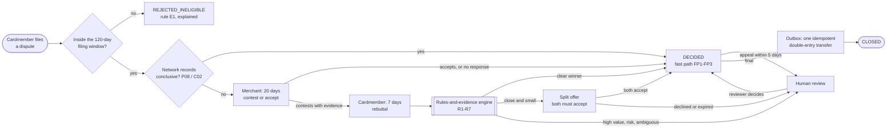

Every arrow above is a database transaction that also appends a signed event to the audit ledger.

---

## 2. Features

### 2.1 Feature map

| ID | Feature | What it delivers | Status |
|---|---|---|---|
| F-01 | Sign-in and roles | Real JWT validation (RS256/ES256 via JWKS), four roles, not-yours = `404` | ✅ built and tested |
| F-02 | Charges list and filing | A cardmember lists their charges and files in ≤ 3 screens; idempotent submit | ✅ built and tested |
| F-03 | Eligibility and fast path | 120-day window (C08 counts from expected delivery); P08/C02 decided at filing | ✅ built and tested |
| F-04 | Evidence and verification | Typed files, statements and carrier tracking; server-assigned reliability | ✅ built and tested |
| F-05 | Merchant response | Contest (needs evidence) or accept, within 20 days; silence means refund | ✅ built and tested |
| F-06 | Rebuttal and withdrawal | The cardmember answers within 7 days, or withdraws | ✅ built and tested |
| F-07 | Automated decisions | Ordered decision table R1–R7 with exact arithmetic; decided within seconds | ✅ built and tested |
| F-08 | Settlement offers | A split both parties must accept within 5 days; otherwise a person decides | ✅ built and tested |
| F-09 | Human review queue | Oldest first with the reason; verdict, split amount and rationale | ✅ built and tested |
| F-10 | Appeals | One appeal per dispute for appealable decisions, within 5 days | ✅ built and tested |
| F-11 | Settlement and closure | Transactional outbox, idempotency keys, double entry, retries, `DEAD` after 10 attempts | ✅ built and tested |
| F-12 | Audit ledger and auditor console | Signed hash chain, verification, checkpoints, public keys | ✅ built and tested |
| F-13 | Notifications and timeline | In-app notifications (15 s polling); timeline read from the ledger | ✅ built and tested |
| F-14 | Explanations | One fixed template per rule, the same text for both parties | ✅ built and tested |
| F-15 | Metrics and simulator | Automation, fast-path, offer and review rates; threshold-calibration simulator | ✅ built and tested |
| F-16 | Personal-data protection | Checksum-validated redaction before storage; safe uploads; no text in logs | ✅ built and tested |
| F-17 | Optional AI assist | A guarded, labelled paraphrase of the explanation, never the decision | ⏸️ designed, **not built** (off by default) |

### 2.2 Reason codes

| Code | Network title | In plain words | Special handling |
|---|---|---|---|
| **C08** | Goods/services not received or only partially received | "I paid but it never arrived." | The filing window counts from the *later* of the transaction date and the expected delivery date. Merchant shipment tracking is checked with the carrier. |
| **C31** | Goods/services not as described | "What arrived is not what was described." | Cardmember return tracking is checked against the merchant's return address. |
| **C02** | Credit not processed | "The merchant promised a refund that never came." | The credit check against network records decides at filing when the credit was already posted (FP3). |
| **P08** | Duplicate charge | "I was charged twice for the same thing." | Duplicate check: same account, SE number, amount and currency within 72 h (FP1/FP2/FP3). |

### 2.3 Who does what

| Role | Who | Can do | Home screen |
|---|---|---|---|
| `cardmember` | Card account holder | See their charges; file, follow, add evidence to, rebut, withdraw and appeal their own disputes; answer offers | My charges + filing form + my disputes |
| `merchant` | Staff of a merchant organisation (one or more SE numbers) | See their organisation's disputes; add evidence; contest or accept; answer offers; appeal | Dispute queue, sorted by due time |
| `reviewer` | Dispute-operations staff | See every dispute; decide `HUMAN_REVIEW` cases; see metrics | Review queue + all disputes + metrics |
| `auditor` | Compliance or internal audit | Read ledger events and case metadata (no evidence contents); verify the chain; create and download checkpoints; see metrics | Ledger integrity console + metrics |

There is **no "system" role reachable over HTTP**: deadlines, decisions and settlement run only in the background worker.

---

## 3. Specifications

### 3.1 Scope

| In scope (v2.0) | Out of scope |
|---|---|
| The four reason codes C08, C31, C02, P08 | Fraud reason codes and 3-D Secure liability shift |
| Filing with eligibility checks and the closed-loop fast path | Provisional credits, charge-offs and collections |
| Typed evidence, including carrier verification | Multi-currency automation (non-INR cases go to a person) |
| Merchant contest/accept; cardmember rebuttal/withdrawal | The two-stage inquiry → chargeback process (modelled as one 20-day window) |
| Automated decisions, offers, human review, appeals | Real Amex, carrier or identity-provider integrations (mocked) |
| Settlement through an outbox with a mock core system | E-mail, SMS and push notifications |
| Signed audit ledger and auditor console | Machine-learning or LLM decisions; OCR of uploads |
| Notifications, timeline and metrics; a web app for four roles; one-host deployment | Native mobile apps |

### 3.2 Functional requirements (summary)

Each requirement has an ID, acceptance criteria and at least one verifying test. The test IDs appear in the test names and comments under [`backend/tests`](backend/tests).

| Area | What the system shall do | Requirements | Verified by |
|---|---|---|---|
| Authentication and authorization | Accept only JWTs whose signature verifies against the IdP's JWKS, with `alg` RS256/ES256 and valid `iss`, `aud`, `exp`, `iat`, `sub` (30 s leeway); recognise exactly four roles; return `404` for anyone else's resource; offer **no** endpoint that triggers decisions, timers or settlement; refuse the dev IdP in production | FR-AUTH-01…05 | T-SEC-01…15 |
| Transactions | List the caller's own CHARGE transactions from the last 180 days, newest first, at most 100, with a dispute link | FR-TXN-01 | T-INT-TXN-01 |
| Filing | Accept exactly `transaction_id`, `reason_code`, `disputed_amount_minor`, `statement` and an `Idempotency-Key`; derive every fact from Amex records; refuse ineligible filings with precise problem types; reject late claims as `REJECTED_INELIGIBLE` (E1); redact the statement; set the velocity risk flag; run the P08/C02 fact checks; apply the fast path; otherwise wait for the merchant 20 days; replays are side-effect free | FR-FILE-01…10 | T-INT-FILE-01…16, T-CONC-01 |
| Evidence | One multipart request per item; the server assigns the source; PDF/JPEG/PNG only, by magic bytes, ≤ 5 MiB, images re-encoded; tracking format and carrier checked; ≤ 20 items per side; append-only; downloads as attachments (auditors see digests only) | FR-EVID-01…07 | T-INT-EVID-01…13, T-SEC-16, T-SEC-17 |
| Merchant response | Contest (needs ≥ 1 merchant-side item) → cardmember rebuttal (+7 days); accept → refund (MA, final); no response in 20 days → refund (R0, appealable) | FR-MERCH-01…03 | T-INT-MERCH-01…03, T-INT-JOB-01 |
| Cardmember actions | "Nothing more to add", or the rebuttal deadline → `READY_FOR_DECISION`; withdraw → `WITHDRAWN` (CW, final) | FR-CM-01, 02 | T-INT-CM-01, 02, T-INT-JOB-02 |
| Automated decision | Evaluate the decision table on the stored evidence with the active policy; store V_M, V_CM and the margin as exact decimal strings; decide, offer or escalate; explain with a fixed template | FR-DEC-01…04 | T-GOLD-ALL, T-PROP-01…07, T-INT-DEC-01…04, T-UNIT-EXPL-01 |
| Settlement offers | Each party answers once; any decline or expiry → human review; both accept → split decision (OA, final) | FR-OFFER-01, 02 | T-INT-OFFER-01…04 |
| Human review | Queue oldest first with the reason; reviewer verdict with a split amount strictly between 0 and A and a 20–2,000-character rationale; final | FR-REV-01, 02 | T-INT-REV-01…03 |
| Appeals | Once per dispute, only for appealable rules (FP1–FP3, R0, R4, R5), within 5 days, with a 20–1,000-character reason that is redacted and never goes to the ledger as text | FR-APPEAL-01 | T-INT-APPEAL-01…04 |
| Settlement and closure | FINALIZE after the appeal window; outbox with key `dispute:{id}:decision:{decision_id}`; retries with backoff min(2ⁿ, 300) s; `DEAD` after 10 attempts; one DEBIT + one CREDIT per transfer; no provisional credits | FR-SETTLE-01…04 | T-INT-SETTLE-01…05 |
| Lifecycle | Every state change through the one transition table under a row lock; illegal pairs → `409`; timers are database rows claimed with `SKIP LOCKED`; handlers are idempotent | FR-FSM-01, 02 | T-UNIT-FSM-01…04, T-CONC-02, T-CONC-03 |
| Audit ledger | Append an event for every significant change in the same transaction; hash, sign and checkpoint exactly as specified; serialize appends; payloads contain no personal data; auditor list/verify/checkpoint/public-key operations; automatic checkpoint every 100 events; Ed25519 key loaded from a file | FR-LED-01…07 | T-UNIT-LED-01…03, T-INT-LED-01…07, T-CONC-04 |
| Notifications and timeline | In-app notifications for every step that concerns a party (and reviewers); a timeline derived from ledger events | FR-NOTIF-01, 02 | T-INT-NOTIF-01, T-INT-TIMELINE-01 |
| Policy | Load one policy file at startup, validate it or refuse to start; record its version on every dispute and decision; publish it at `GET /api/v1/policy` | FR-POLICY-01 | T-UNIT-POL-01, T-INT-POL-01 |
| Metrics and simulation | Metrics summary for a date range; a command-line threshold-calibration simulator | FR-METRIC-01, 02 | T-INT-METRIC-01, demonstration |
| Web application | Screens for all four roles showing only the actions allowed now (the server re-checks every one) | FR-UI-01…05 | T-E2E-01…06 |

### 3.3 Non-functional requirements

| Category | Requirement | Target | Verification |
|---|---|---|---|
| Performance | Non-upload API endpoints | p95 < 300 ms at 20 req/s for 5 min | Load procedure on the demo host (T-PERF-01) |
| | `READY_FOR_DECISION` → outcome committed | p95 < 5 s (worker polls every 1 s) | Ledger query procedure (T-PERF-02) |
| | Filing | p95 < 500 ms | Load procedure (T-PERF-01) |
| | Full ledger verification | 10,000 events < 10 s | **Automated** (T-PERF-03) |
| | 5 MiB image upload, end to end | < 3 s on a local network | Procedure (T-PERF-04) |
| Security | No default secrets; startup fails on missing or weak configuration | — | T-SEC-15 |
| | Least-privilege database role: no DELETE, no DDL, read-only reference data | — | T-INT-DB-01 |
| | `nosniff`, `no-referrer`, `no-store` on every response; strict CSP for the SPA | — | T-SEC-18 |
| | Errors never echo input; no stack traces | — | T-SEC-19 |
| | CORS only for configured origins; API docs disabled in production | — | T-SEC-20 |
| | 120 requests/min per user; ≤ 10 filings per cardmember per rolling 24 h | `429` + `Retry-After` | T-SEC-21 |
| | Dependency, static-analysis and image scans in CI | fail on high/critical | CI |
| Privacy | Redaction before storage (cards, Aadhaar, SSN, PAN card, phone, e-mail, UPI) | — | T-UNIT-RED-01…14 |
| | No bodies, statements, notes, files or tokens in logs; subjects pseudonymised | — | T-SEC-22 |
| | Single Indian region; no third-party AI processing | — | Inspection |
| Reliability | No lost timers; restart-safe worker | — | T-CONC-03, T-INT-JOB-05 |
| | Money moves at most once per decision | — | T-INT-SETTLE-05 |
| | `/healthz`, `/readyz`, worker heartbeat | — | T-INT-HEALTH-01 |
| Maintainability | `app/domain` pure with ≥ 95 % coverage; backend ≥ 80 % | CI gates | CI |
| | ruff (E, F, W, B, S) + bandit; `tsc --strict` + eslint | clean | CI |
| | One policy file, one decision table, one transition table | — | T-GOLD-ALL, review |
| Accessibility | WCAG 2.2 AA on key flows (keyboard, focus, labels, contrast ≥ 4.5:1) | — | axe scan + manual check |
| Usability | A new cardmember files a dispute in ≤ 3 screens | — | Demonstration |
| Operations | `docker compose up` starts everything; JSON logs; configuration only from environment + policy | — | Demonstration, T-SEC-15, T-SEC-22 |

> [!NOTE]
> Performance targets other than T-PERF-03 are verified by procedure on the demo host. They are **targets, not measured claims**.

### 3.4 Constraints

1. **Money** is always an integer number of minor units (paise). No floating point in any decision, amount or hash.
2. **Every number** the engine uses comes from the versioned policy file.
3. **No full card number (PAN)** is stored anywhere. Accounts are referenced by vault tokens; display masks show at most BIN + last four.
4. **No third-party AI** service receives dispute data.
5. **Synthetic data only.**

---

## 4. Dispute lifecycle

Filing is **creation**, not a transition: it produces `REJECTED_INELIGIBLE`, `AWAITING_MERCHANT` or `DECIDED` (fast path). After that, a dispute moves only through the transition table in [`backend/app/domain/fsm.py`](backend/app/domain/fsm.py), via `services.common.move()`, under a row lock. Any other (state, event) pair is illegal and returns `409 illegal-state`.

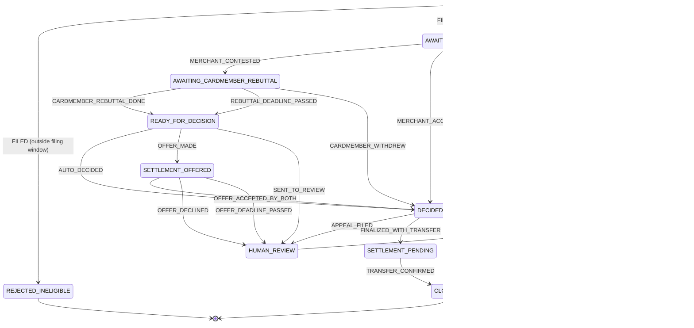

<details>
<summary><b>The complete transition table (18 transitions)</b></summary>

| From | Event | To |
|---|---|---|
| AWAITING_MERCHANT | MERCHANT_CONTESTED | AWAITING_CARDMEMBER_REBUTTAL |
| AWAITING_MERCHANT | MERCHANT_ACCEPTED | DECIDED |
| AWAITING_MERCHANT | MERCHANT_DEADLINE_PASSED | DECIDED |
| AWAITING_MERCHANT | CARDMEMBER_WITHDREW | DECIDED |
| AWAITING_CARDMEMBER_REBUTTAL | CARDMEMBER_REBUTTAL_DONE | READY_FOR_DECISION |
| AWAITING_CARDMEMBER_REBUTTAL | REBUTTAL_DEADLINE_PASSED | READY_FOR_DECISION |
| AWAITING_CARDMEMBER_REBUTTAL | CARDMEMBER_WITHDREW | DECIDED |
| READY_FOR_DECISION | AUTO_DECIDED | DECIDED |
| READY_FOR_DECISION | OFFER_MADE | SETTLEMENT_OFFERED |
| READY_FOR_DECISION | SENT_TO_REVIEW | HUMAN_REVIEW |
| SETTLEMENT_OFFERED | OFFER_ACCEPTED_BY_BOTH | DECIDED |
| SETTLEMENT_OFFERED | OFFER_DECLINED | HUMAN_REVIEW |
| SETTLEMENT_OFFERED | OFFER_DEADLINE_PASSED | HUMAN_REVIEW |
| HUMAN_REVIEW | REVIEWER_DECIDED | DECIDED |
| DECIDED | APPEAL_FILED | HUMAN_REVIEW |
| DECIDED | FINALIZED_WITH_TRANSFER | SETTLEMENT_PENDING |
| DECIDED | FINALIZED_NO_TRANSFER | CLOSED |
| SETTLEMENT_PENDING | TRANSFER_CONFIRMED | CLOSED |

</details>

### 4.1 What each role may do in each state

| State | Cardmember | Merchant | Reviewer | Worker (timer) |
|---|---|---|---|---|
| `REJECTED_INELIGIBLE` | view | view (not notified) | view | — |
| `AWAITING_MERCHANT` | view, add evidence, withdraw | view, add evidence, **contest**, **accept** | view | MERCHANT_DEADLINE (20 days) |
| `AWAITING_CARDMEMBER_REBUTTAL` | view, add evidence, **rebuttal done**, withdraw | view | view | REBUTTAL_DEADLINE (7 days) |
| `READY_FOR_DECISION` | view | view | view | DECIDE (immediately) |
| `SETTLEMENT_OFFERED` | view, accept/decline offer | view, accept/decline offer | view | OFFER_DEADLINE (5 days) |
| `HUMAN_REVIEW` | view | view | view, **decide** | — |
| `DECIDED` | view, appeal (if appealable and open) | view, appeal (if appealable and open) | view | FINALIZE (at the end of the appeal window) |
| `SETTLEMENT_PENDING` | view | view | view | outbox relay |
| `CLOSED` | view | view | view | — |

Auditors can view every state (metadata only) and have no actions. The UI shows buttons from the server's `allowed_actions`, and the server re-checks every action anyway.

### 4.2 Timers are database rows

| Job | Created when | What the worker does (one transaction, after re-checking the state) |
|---|---|---|
| `MERCHANT_DEADLINE` | The dispute enters `AWAITING_MERCHANT` | Still waiting? Decision R0 (refund, appealable) → `DECIDED`, FINALIZE scheduled |
| `REBUTTAL_DEADLINE` | The dispute enters `AWAITING_CARDMEMBER_REBUTTAL` | Still waiting? → `READY_FOR_DECISION`, DECIDE now |
| `DECIDE` | The dispute enters `READY_FOR_DECISION` | Run the decision table and apply its outcome |
| `OFFER_DEADLINE` | The dispute enters `SETTLEMENT_OFFERED` | Still open? → `HUMAN_REVIEW` (`OFFER_EXPIRED`) |
| `FINALIZE` | A decision is recorded | Decision final or appeal window over? Refund > 0 → outbox + `SETTLEMENT_PENDING`; otherwise `CLOSED` |

Handlers first lock the dispute and check that the state still matches. If it does not, the job is marked done and nothing happens. A job can therefore run late, twice, or after a person already acted, and the outcome is still correct. Failing handlers are retried with backoff `min(2ⁿ, 300)` seconds. After 10 attempts a job becomes `FAILED`, reviewers are notified, and the dispute is left untouched.

> The verdict (`CARDMEMBER_REFUND`, `MERCHANT_UPHELD`, `SPLIT_SETTLEMENT`, `WITHDRAWN`) is an attribute of a **decision** row, not a state. A dispute can have several decisions over time (for example R4, then an appeal, then a reviewer decision). `disputes.current_decision_id` points to the one in force.

---

## 5. Decision engine

The engine is **pure** Python in [`backend/app/domain`](backend/app/domain): no database, no network, no clock. It is fully specified by the policy file [`policy/policy.2026.09.1.yaml`](policy/policy.2026.09.1.yaml), reproduced by 18 golden vectors and checked by property tests over thousands of random cases.

### 5.1 Design principles

1. **Facts over claims.** Scores depend on *how* evidence was obtained (system-verified > document > self-attested), not only on what a party says.
2. **Procedure is a gate, not a weight.** Timeliness and eligibility are lifecycle rules (E1, R0). They never add points to a score.
3. **Evidence-only, symmetric score.** Only evidence relevant to the reason code counts. The score is centred at 0 = balanced.
4. **No cliffs, no forced scores.** Every recorded value is the value the formula produced.
5. **Exhaustive decision table.** Exactly one outcome for every possible input.
6. **Exact and reproducible.** No floating point. Any auditor can replay a decision to the last digit.

### 5.2 Evidence sources and reliability

The **server** assigns the source. A client can never choose it or claim "verified".

| Source | Reliability r | How an item gets it |
|---|---|---|
| `system_verified` | **1.0** | Confirmed by a system: the carrier API, Amex records |
| `document` | **0.7** | An uploaded file (PDF, JPEG, PNG) |
| `self_attested` | **0.3** | A typed statement, or a tracking number the carrier does not know |

Carrier tracking can create evidence for **either** side. The system reports what the carrier says, whoever submitted the number:

| Submission | Who | Codes | Carrier result | Item created (side) | Source |
|---|---|---|---|---|---|
| `shipment_tracking` | merchant | C08 | DELIVERED to the account's shipping postcode | `carrier_delivery_confirmation` (merchant) | system_verified |
| `shipment_tracking` | merchant | C08 | DELIVERED to a different postcode | `carrier_wrong_address` (cardmember) | system_verified |
| `shipment_tracking` | merchant | C08 | IN_TRANSIT, NOT_DELIVERED, RETURNED_TO_SENDER | `carrier_not_delivered` (cardmember) | system_verified |
| `shipment_tracking` | merchant | C08 | NOT_FOUND (unknown tracking number) | `carrier_delivery_confirmation` (merchant) | self_attested |
| `return_tracking` | cardmember | C31, C02 | DELIVERED to the merchant's return postcode | `return_shipment` (cardmember) | system_verified |
| `return_tracking` | cardmember | C31, C02 | anything else | `return_shipment` (cardmember) | self_attested |

Supported carriers (mocked): `BLUEDART`, `DELHIVERY`, `DTDC`, `INDIA_POST`. Tracking numbers must match `^[A-Za-z0-9]{8,30}$`.

<details>
<summary><b>The evidence catalogue per reason code (weights from the policy file)</b></summary>

Strength = weight × reliability of the source the submission produces (file → document 0.7, text → self-attested 0.3, tracking → system-verified 1.0 when the carrier confirms it). ★ = compelling (only merchant types can be).

**C08: not received**

| Evidence type | Side | Weight | Produced by | Typical strength |
|---|---|---|---|---|
| `carrier_delivery_confirmation` ★ | Merchant | 0.90 | tracking | 0.90 verified · 0.27 if the carrier does not know it |
| `signed_proof_of_delivery` ★ | Merchant | 0.80 | file | 0.56 |
| `digital_delivery_log` ★ | Merchant | 0.70 | file | 0.49 |
| `merchant_statement` | Merchant | 0.15 | text | 0.045 |
| `carrier_not_delivered` | Cardmember | 0.90 | tracking | 0.90 |
| `carrier_wrong_address` | Cardmember | 0.85 | tracking | 0.85 |
| `merchant_correspondence` | Cardmember | 0.50 | file | 0.35 |
| `written_statement` | Cardmember | 0.15 | text | 0.045 |

**C31: not as described**

| Evidence type | Side | Weight | Produced by | Typical strength |
|---|---|---|---|---|
| `cardmember_acceptance` ★ | Merchant | 0.80 | file | 0.56 |
| `description_match_proof` ★ | Merchant | 0.60 | file | 0.42 |
| `repair_or_replacement_offer` | Merchant | 0.40 | file | 0.28 |
| `merchant_statement` | Merchant | 0.15 | text | 0.045 |
| `return_shipment` | Cardmember | 0.70 | tracking | 0.70 verified · 0.21 otherwise |
| `item_photos` | Cardmember | 0.60 | file | 0.42 |
| `merchant_correspondence` | Cardmember | 0.50 | file | 0.35 |
| `written_statement` | Cardmember | 0.15 | text | 0.045 |

**C02: credit not processed**

| Evidence type | Side | Weight | Produced by | Typical strength |
|---|---|---|---|---|
| `refund_policy_disclosure` ★ | Merchant | 0.60 | file | 0.42 |
| `merchant_statement` | Merchant | 0.15 | text | 0.045 |
| `credit_acknowledgment` | Cardmember | 0.85 | file | 0.595 |
| `return_shipment` | Cardmember | 0.70 | tracking | 0.70 verified · 0.21 otherwise |
| `written_statement` | Cardmember | 0.15 | text | 0.045 |

**P08: duplicate charge** (only reached when the fast-path fact check is inconclusive)

| Evidence type | Side | Weight | Produced by | Typical strength |
|---|---|---|---|---|
| `distinct_orders_proof` ★ | Merchant | 0.85 | file | 0.595 |
| `merchant_statement` | Merchant | 0.15 | text | 0.045 |
| `single_order_proof` | Cardmember | 0.80 | file | 0.56 |
| `written_statement` | Cardmember | 0.15 | text | 0.045 |

The cardmember's `written_statement` is present in every dispute: the statement is mandatory at filing.

</details>

### 5.3 Scoring: deduplicated noisy-OR

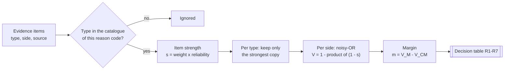

```math
s_i = w(t_i)\cdot r(\mathrm{source}_i)
\qquad
s_t = \max_{i\,:\,t_i = t} s_i
\qquad
V_X = 1-\prod_{t \in T_X}\bigl(1 - s_t\bigr)
\qquad
m = V_M - V_{CM} \in (-1,\,1)
```

- If each distinct item were independent evidence that is "right" with probability $s_t$, then $V_X$ is the probability that at least one of them is right.
- The **same type counts once**, at its strongest copy. Pasting a statement five times changes nothing, and five *distinct* weak items still add up with diminishing returns.
- $m > 0$ favours the merchant, $m < 0$ the cardmember, and $m = 0$ is balanced.

**Compelling guard κ (burden of proof).** A merchant can win automatically only with at least one **compelling, non-self-attested** merchant item. A cardmember can win on the margin alone. This mirrors network rules, where the merchant must substantiate the charge, and stops a merchant from winning on typed claims.

### 5.4 The decision table

Rules are tested **in order**; the first match wins, and R7 matches everything. V_M, V_CM and the margin are computed and recorded for **every** outcome, including R1–R3, so reviewers see them.

| Order | Rule | Condition | Outcome | Verdict | Refund |
|---|---|---|---|---|---|
| 1 | `R1_AMOUNT_ABOVE_AUTO_LIMIT` | A > ₹50,000.00 | `HUMAN_REVIEW` | — | — |
| 2 | `R2_NON_BASE_CURRENCY` | currency ≠ INR | `HUMAN_REVIEW` | — | — |
| 3 | `R3_RISK_FLAG` | risk flag set (≥ 3 disputes by the filer in the previous 90 days) | `HUMAN_REVIEW` | — | — |
| 4 | `R4_MERCHANT_EVIDENCE_STRONGER` | m ≥ **+0.40** and κ | `DECIDED` | `MERCHANT_UPHELD` | 0 |
| 5 | `R5_CARDMEMBER_EVIDENCE_STRONGER` | m ≤ **−0.40** | `DECIDED` | `CARDMEMBER_REFUND` | A |
| 6 | `R6_SETTLEMENT_OFFER` | ₹2.00 ≤ A ≤ ₹10,000.00 | `SETTLEMENT_OFFERED` | — | ρ |
| 7 | `R7_AMBIGUOUS` | always | `HUMAN_REVIEW` | — | — |

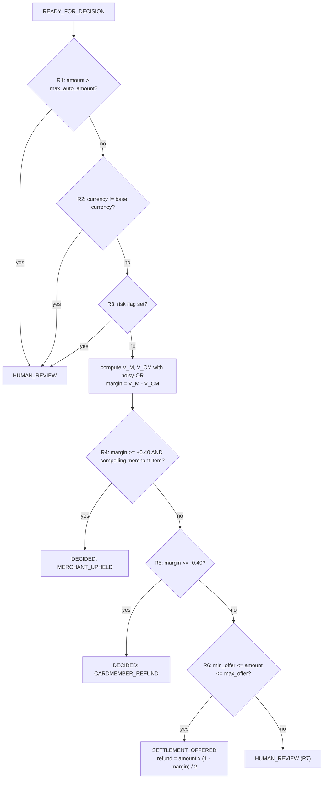

Boundaries are **inclusive** (`≥`, `≤`), and a margin exactly on a threshold is decided (tested as T-UNIT-DEC-01).

### 5.5 Settlement offers

For a case that reaches R6, the cardmember's share σ and the offered refund ρ (in paise) are:

```math
\sigma = \frac{1 - m}{2}
\qquad
\rho = \operatorname{rhe}\bigl(A \cdot \sigma\bigr)
\quad\text{(round half to even)}
```

With the shipped catalogue, a case reaching R6 has $-0.40 < m < 0.40$, so $\sigma \in (0.30,\,0.70)$ and $1 \le \rho \le A - 1$: **both parties always give up something and get something** (property T-PROP-06). Swapping the sides negates *m* and turns σ into 1 − σ, so the two parties' offers mirror each other. The offer binds **only if both parties accept within 5 days** (`OA_OFFER_ACCEPTED`, final). Any decline or expiry sends the case to a reviewer.

### 5.6 Rules that do not use the score

| Rule | Trigger | Verdict | Refund | Appealable |
|---|---|---|---|---|
| `E1_FILING_WINDOW_EXPIRED` | Claim outside the filing window | — (state `REJECTED_INELIGIBLE`) | — | no |
| `FP1_DUPLICATE_CONFIRMED` | Fast path | `CARDMEMBER_REFUND` | A | **yes** |
| `FP2_NO_DUPLICATE_FOUND` | Fast path | `MERCHANT_UPHELD` | 0 | **yes** |
| `FP3_CREDIT_ALREADY_POSTED` | Fast path | `MERCHANT_UPHELD` | 0 | **yes** |
| `R0_MERCHANT_NO_TIMELY_RESPONSE` | Merchant deadline passes in `AWAITING_MERCHANT` | `CARDMEMBER_REFUND` | A | **yes** |
| `MA_MERCHANT_ACCEPTED` | Merchant accepts | `CARDMEMBER_REFUND` | A | no |
| `CW_CARDMEMBER_WITHDREW` | Cardmember withdraws | `WITHDRAWN` | 0 | no |
| `OA_OFFER_ACCEPTED` | Both parties accept the offer | `SPLIT_SETTLEMENT` | ρ | no |
| `HR_REVIEWER_DECISION` | Reviewer decides | refund / upheld / split | A / 0 / 1…A−1 | no |

**Appeals.** An appealable decision (FP1–FP3, R0, R4, R5) can be appealed **once per dispute**, by either party, within 5 days. The case goes to a reviewer, whose decision is final. Money moves only after the appeal window closes (or at once for non-appealable decisions), so an appeal never needs a reversal.

### 5.7 Eligibility, time and closed-loop fact checks

**Filing window.** All timestamps are stored in UTC. Calendar dates are counted in the policy time zone, `Asia/Kolkata` (IST).

```text
anchor     = transaction date (IST); for C08 the later of the transaction date and the expected delivery date
last_day   = anchor + 120 days                        (inclusive)
deadline   = 00:00:00 IST on last_day + 1
eligible  <=> claim_received_at < deadline            (claim_received_at is frozen at filing)
```

*Example:* a transaction at 10 Jan 2026 20:00 UTC is 11 Jan 01:30 IST, so the anchor is 11 Jan and the deadline is 12 May 2026 00:00 IST. The expected delivery date comes from the network's own order data, **never** from the cardmember's request. Freezing `claim_received_at` means later stages can never use up the cardmember's window.

**Stage windows** are exact 24-hour days from entering the state: merchant 20 days, rebuttal 7 days, offer 5 days, appeal 5 days.

**P08 duplicate check.** A charge T′ is *similar* to the disputed charge T when it is another CHARGE on the same account, SE number, amount and currency within **72 hours**. The first matching line wins:

| Order | Condition | Result |
|---|---|---|
| 1 | No similar charge | `NOT_FOUND` |
| 2 | A credit ≥ the charge references T or a similar charge | `CREDIT_ALREADY_POSTED` |
| 3 | A similar charge has the same order reference (or both have none) | `CONFIRMED` |
| 4 | Otherwise | `INCONCLUSIVE` |

**C02 credit check.** credited ≥ A → `CREDIT_ALREADY_POSTED`; 0 < credited < A → `PARTIAL_CREDIT_FOUND`; nothing credited → `NO_CREDIT_FOUND`.

**Fast path.** A conclusive fact, A ≤ ₹50,000 and INR → the dispute is created directly in `DECIDED`:

| Code | Fact | Verdict | Rule |
|---|---|---|---|
| P08 | `CONFIRMED` | `CARDMEMBER_REFUND` (refund = A) | FP1 |
| P08 | `NOT_FOUND` | `MERCHANT_UPHELD` | FP2 |
| P08 / C02 | `CREDIT_ALREADY_POSTED` | `MERCHANT_UPHELD` | FP3 |
| any other combination | — | normal flow (`AWAITING_MERCHANT`) | — |

**Velocity risk flag.** Three or more earlier disputes by the same cardmember in the previous 90 days set `HIGH_DISPUTE_VELOCITY`. The flag **never denies** anything: it only routes the case to a person (R3), and parties never see it, not even inside an explanation.

### 5.8 Worked examples

<table>
<tr><th>G02: signed proof of delivery (merchant wins)</th><th>G04: conflicting evidence (offer)</th></tr>
<tr><td valign="top">

1. `signed_proof_of_delivery` (merchant, document): 0.80 × 0.7 = **0.56**
2. `written_statement` (cardmember, self-attested): 0.15 × 0.3 = **0.045**
3. V_M = 0.56, V_CM = 0.045 → **m = 0.515**
4. R1–R3 do not apply. R4: m ≥ 0.40 and the signed POD is compelling and not self-attested → **MERCHANT_UPHELD**, refund 0, appealable for 5 days.

</td><td valign="top">

1. `carrier_wrong_address` (cardmember, system): **0.85**; `signed_proof_of_delivery` (merchant, document): **0.56**; `written_statement`: **0.045**
2. V_M = 0.56; V_CM = 1 − (0.15 × 0.955) = **0.85675**
3. m = **−0.29675**: neither R4 nor R5 applies
4. R6: σ = 0.648375; A·σ = 499,900 × 0.648375 = 324,122.6625 → **ρ = 324,123** (₹3,241.23 to the cardmember; the merchant keeps ₹1,757.77)

</td></tr>
</table>

<details>
<summary><b>All 18 golden vectors (normative: reproduced exactly by <code>test_golden.py</code>)</b></summary>

**Inputs**

| ID | Evidence items (type · source) |
|---|---|
| G01 | carrier_delivery_confirmation · system_verified; written_statement · self_attested |
| G02 | signed_proof_of_delivery · document; written_statement · self_attested |
| G03 | carrier_not_delivered · system_verified; merchant_statement · self_attested; written_statement · self_attested |
| G04 | carrier_wrong_address · system_verified; signed_proof_of_delivery · document; written_statement · self_attested |
| G05 | merchant_statement · self_attested; written_statement · self_attested |
| G06 | merchant_statement · self_attested; written_statement · self_attested |
| G07 | carrier_delivery_confirmation · system_verified; written_statement · self_attested |
| G08 | carrier_delivery_confirmation · system_verified; written_statement · self_attested |
| G09 | carrier_delivery_confirmation · system_verified; written_statement · self_attested |
| G10 | carrier_delivery_confirmation · self_attested; merchant_statement · self_attested; merchant_correspondence · document; written_statement · self_attested |
| G11 | description_match_proof · document; item_photos · document; written_statement · self_attested |
| G12 | cardmember_acceptance · document; description_match_proof · document; written_statement · self_attested |
| G13 | return_shipment · system_verified; item_photos · document; merchant_statement · self_attested; written_statement · self_attested |
| G14 | credit_acknowledgment · document; refund_policy_disclosure · document; written_statement · self_attested |
| G15 | distinct_orders_proof · document; written_statement · self_attested |
| G16 | merchant_statement · self_attested (×5); written_statement · self_attested |
| G17 | repair_or_replacement_offer · document; merchant_statement · self_attested; written_statement · self_attested |
| G18 | cardmember_acceptance · document; merchant_statement · self_attested; written_statement · self_attested |

**Expected outputs**

| ID | Scenario | Code | Amount (minor) | V_M | V_CM | Margin | Rule | Outcome | Verdict | Refund (minor) |
|---|---|---|---|---|---|---|---|---|---|---|
| G01 | C08: carrier API confirms delivery to the cardmember's postcode | C08 | 499900 INR | 0.9 | 0.045 | 0.855 | R4_MERCHANT_EVIDENCE_STRONGER | DECIDED | MERCHANT_UPHELD | 0 |
| G02 | C08: signed proof of delivery uploaded | C08 | 499900 INR | 0.56 | 0.045 | 0.515 | R4_MERCHANT_EVIDENCE_STRONGER | DECIDED | MERCHANT_UPHELD | 0 |
| G03 | C08: carrier API says not delivered | C08 | 499900 INR | 0.045 | 0.9045 | -0.8595 | R5_CARDMEMBER_EVIDENCE_STRONGER | DECIDED | CARDMEMBER_REFUND | 499900 |
| G04 | C08: carrier delivered to a different postcode; merchant uploads signed POD | C08 | 499900 INR | 0.56 | 0.85675 | -0.29675 | R6_SETTLEMENT_OFFER | SETTLEMENT_OFFERED | — | 324123 |
| G05 | C08: statements only on both sides (small amount) | C08 | 499900 INR | 0.045 | 0.045 | 0 | R6_SETTLEMENT_OFFER | SETTLEMENT_OFFERED | — | 249950 |
| G06 | C08: statements only, amount above the offer limit | C08 | 2000000 INR | 0.045 | 0.045 | 0 | R7_AMBIGUOUS | HUMAN_REVIEW | — | — |
| G07 | C08: amount above the automation limit | C08 | 6000000 INR | 0.9 | 0.045 | 0.855 | R1_AMOUNT_ABOVE_AUTO_LIMIT | HUMAN_REVIEW | — | — |
| G08 | C08: non-base currency | C08 | 499900 USD | 0.9 | 0.045 | 0.855 | R2_NON_BASE_CURRENCY | HUMAN_REVIEW | — | — |
| G09 | C08: dispute-velocity risk flag | C08 | 499900 INR | 0.9 | 0.045 | 0.855 | R3_RISK_FLAG | HUMAN_REVIEW | — | — |
| G10 | C08: unverifiable tracking vs cardmember correspondence | C08 | 499900 INR | 0.30285 | 0.37925 | -0.0764 | R6_SETTLEMENT_OFFER | SETTLEMENT_OFFERED | — | 269046 |
| G11 | C31: listing proof vs cardmember photos | C31 | 349900 INR | 0.42 | 0.4461 | -0.0261 | R6_SETTLEMENT_OFFER | SETTLEMENT_OFFERED | — | 179516 |
| G12 | C31: cardmember accepted the item in writing | C31 | 349900 INR | 0.7448 | 0.045 | 0.6998 | R4_MERCHANT_EVIDENCE_STRONGER | DECIDED | MERCHANT_UPHELD | 0 |
| G13 | C31: verified return shipment plus photos | C31 | 349900 INR | 0.045 | 0.83383 | -0.78883 | R5_CARDMEMBER_EVIDENCE_STRONGER | DECIDED | CARDMEMBER_REFUND | 349900 |
| G14 | C02: credit promise vs refund-policy disclosure | C02 | 250000 INR | 0.42 | 0.613225 | -0.193225 | R6_SETTLEMENT_OFFER | SETTLEMENT_OFFERED | — | 149153 |
| G15 | P08 (inconclusive fact check): merchant proves two distinct orders | P08 | 129900 INR | 0.595 | 0.045 | 0.55 | R4_MERCHANT_EVIDENCE_STRONGER | DECIDED | MERCHANT_UPHELD | 0 |
| G16 | G05 with the merchant statement repeated five times (no stacking) | C08 | 499900 INR | 0.045 | 0.045 | 0 | R6_SETTLEMENT_OFFER | SETTLEMENT_OFFERED | — | 249950 |
| G17 | C31: only non-compelling merchant evidence (repair offer) vs cardmember statement | C31 | 349900 INR | 0.3124 | 0.045 | 0.2674 | R6_SETTLEMENT_OFFER | SETTLEMENT_OFFERED | — | 128168 |
| G18 | C08: evidence that belongs to another reason code is ignored | C08 | 499900 INR | 0.045 | 0.045 | 0 | R6_SETTLEMENT_OFFER | SETTLEMENT_OFFERED | — | 249950 |

</details>

### 5.9 Proven properties

| # | Property | Why it matters | Checked by |
|---|---|---|---|
| P1 | **Boundedness:** 0 ≤ V < 1, so m ∈ (−1, 1) | No saturation or overflow | T-PROP-07 |
| P2 | **Item monotonicity:** adding an item never lowers its own side and never touches the other side | More evidence never hurts you | T-PROP-02, T-PROP-03 |
| P3 | **Order and duplicate invariance** | Reordering or repeating items changes nothing | T-PROP-04, T-PROP-05 |
| P4 | **Decision monotonicity:** a merchant item never moves the outcome toward the cardmember, and vice versa | No perverse incentives | T-PROP-02, T-PROP-03 (3,000 random cases each) |
| P5 | **Exhaustive and exclusive:** exactly one outcome for every input | No undefined grid points | T-PROP-01 |
| P6 | **Symmetric score:** relabelling the sides maps m to −m; offer shares are complementary | Even-handed thresholds | T-PROP-06 |
| P7 | **Deliberate asymmetry:** only κ, the burden of proof on the merchant | Mirrors network rules | T-UNIT-DEC-02 |
| P8 | **No cliffs, no forced scores** | Every stored value is the formula's value | Golden vectors |
| P9 | **Exact replay:** every value is a terminating decimal, stored as an exact string | An auditor can recompute any decision | T-PROP-07, T-GOLD-ALL |
| P10 | **Stacking resistance:** n copies count once; k distinct weak items give diminishing returns | You cannot type your way to a win | T-PROP-04 |
| P11 | **Guard headroom:** the strongest merchant value without a compelling item is 0.3124 < 0.40 | κ is a defensive guard in today's catalogue | T-UNIT-DEC-02 (with θ = 0.20) |

### 5.10 Threshold calibration (synthetic)

`make simulate` generates 20,000 synthetic C08 disputes with a hidden truth and sweeps the threshold θ = θ_M = −θ_C. The assumptions are invented: 50 % of merchants are right; a right merchant gives tracking 70 % of the time and the carrier verifies it 95 % of the time; a wrong merchant's tracking shows not delivered or a wrong address 90 % of the time; half of all offers are declined. The costs are c_err = 10 and c_rev = 1.

| θ | Automated | Error rate among automated | Offered | Human review | Expected cost / case |
|---|---|---|---|---|---|
| 0.10 | 77.7 % | 6.34 % | 18.4 % | 3.9 % | 0.624 |
| 0.20 | 77.4 % | 6.15 % | 18.7 % | 3.9 % | 0.609 |
| 0.30 | 74.6 % | 4.75 % | 21.2 % | 4.3 % | 0.502 |
| **0.40** | **59.8 %** | **2.41 %** | **33.6 %** | **6.6 %** | **0.378** |
| 0.50 | 59.8 % | 2.41 % | 33.6 % | 6.6 % | 0.378 |
| 0.60 | 46.7 % | 0.22 % | 44.5 % | 8.8 % | 0.321 |

**Why ±0.40:** it halves the automated error rate compared with 0.30 (2.41 % vs 4.75 %) while still automating about 60 % of cases. 0.60 is cheaper under these made-up costs but pushes 45 % of cases into offers. The numbers are **illustrative**: the procedure is to recalibrate on labelled historical outcomes, report the change per reason code, regenerate the golden vectors and bump `policy_version` before any policy change.

### 5.11 Explanations

Every decision, offer and review status carries an explanation from **one fixed template per rule id**, filled with computed values. Both parties see identical text. A test checks that every rule and status reason has exactly one template and that every template fills completely (T-UNIT-EXPL-01).

> **Example (R4):** "The merchant's evidence was clearly stronger: merchant 90% vs cardmember 4.5%. Merchant evidence considered: carrier delivery confirmation (verified by system). The charge stands."

<details>
<summary><b>All explanation templates (<code>backend/app/domain/explain.py</code>)</b></summary>

```text
E1_FILING_WINDOW_EXPIRED        This claim was received after the last filing day ({deadline_local}). The filing window is {window_days} days from {anchor_label}.
FP1_DUPLICATE_CONFIRMED         Our records show a second identical charge from the same merchant within {window_hours} hours with the same order reference. The duplicate is refunded.
FP2_NO_DUPLICATE_FOUND          Our records show no second charge of the same amount from this merchant within {window_hours} hours, so no duplicate was found.
FP3_CREDIT_ALREADY_POSTED       Our records show the merchant has already credited this charge, so there is nothing further to refund.
R0_MERCHANT_NO_TIMELY_RESPONSE  The merchant did not respond within {merchant_days} days, so the disputed amount is refunded.
MA_MERCHANT_ACCEPTED            The merchant accepted the dispute. The disputed amount is refunded.
CW_CARDMEMBER_WITHDREW          The cardmember withdrew the dispute. The charge stands.
R1_AMOUNT_ABOVE_AUTO_LIMIT      Disputes above {max_auto} are always decided by a person.
R2_NON_BASE_CURRENCY            Disputes in currencies other than {base_currency} are decided by a person.
R3_RISK_FLAG                    This dispute was routed to a person for an additional review.
R4_MERCHANT_EVIDENCE_STRONGER   The merchant's evidence was clearly stronger: merchant {v_m_pct}% vs cardmember {v_cm_pct}%. Merchant evidence considered: {merchant_items}. The charge stands.
R5_CARDMEMBER_EVIDENCE_STRONGER The cardmember's evidence was clearly stronger: cardmember {v_cm_pct}% vs merchant {v_m_pct}%. Cardmember evidence considered: {cardmember_items}. The disputed amount is refunded.
R6_SETTLEMENT_OFFER             The evidence was close (merchant {v_m_pct}% vs cardmember {v_cm_pct}%). Both parties are offered a split: {refund} refunded to the cardmember. If either party declines, a person decides.
R7_AMBIGUOUS                    The evidence was close, so a person will decide.
OA_OFFER_ACCEPTED               Both parties accepted the settlement offer of {refund}.
HR_REVIEWER_DECISION            A reviewer decided this dispute: {reviewer_rationale}
OFFER_DECLINED                  The settlement offer was declined, so a person will decide.
OFFER_EXPIRED                   The settlement offer was not accepted by both parties within {offer_days} days, so a person will decide.
APPEAL_BY_CARDMEMBER            The cardmember appealed the automated decision. A person will review it.
APPEAL_BY_MERCHANT              The merchant appealed the automated decision. A person will review it.
```

</details>

---

## 6. Architecture

### 6.1 In one page

- **One codebase, two processes.** `api` (FastAPI, stateless HTTP) and `worker` (timers, decisions, settlement relay, checkpoints) share one Python package and one database. There are no microservices.
- **One database.** PostgreSQL 16 holds everything: disputes, evidence (including files up to 5 MiB), decisions, jobs, the outbox, notifications, the audit ledger and the **mock** Amex core tables. No Redis, Kafka, Celery or S3.
- **Three layers.** `api` (HTTP only) → `services` (SQL and business steps, one transaction per command) → `domain` (pure functions), with `gateways` as adapters to the outside world.
- **Rules-first decisions.** A pure, exact, ordered decision table. No ML model or LLM anywhere in the decision path.
- **Safety by construction.** Real JWT validation, a least-privilege database role, append-only tables, locked transitions, a serialized and signed hash chain, and an outbox with idempotency keys.

### 6.2 System context

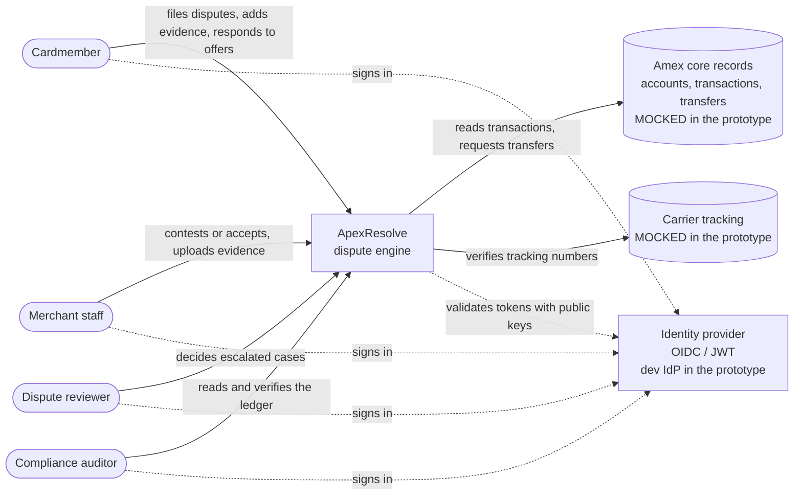

| External system | Real world | Prototype |
|---|---|---|
| Amex core records | Authorization and clearing data, accounts, posting system | `core_*` tables behind `MockCore`, seeded with synthetic data |
| Carrier tracking | Carrier APIs | `MockCarrier`, backed by a JSON fixture file |
| Identity provider | Enterprise OIDC | `devidp`: a dev-only token issuer with the same JWT format and a published JWKS |

### 6.3 Containers

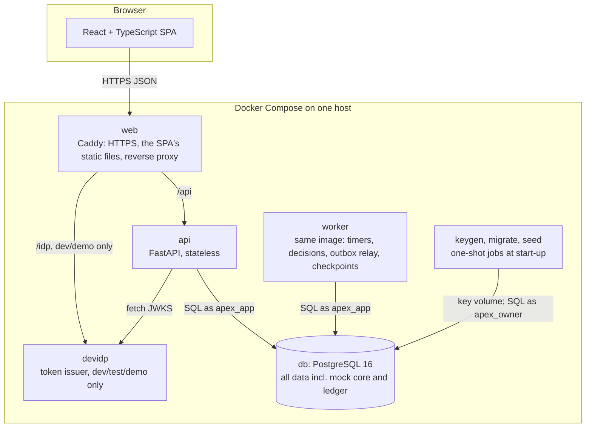

| Service | Image and command | Responsibility | Scales? |
|---|---|---|---|
| `web` | Vite build served by Caddy 2 | HTTPS (automatic certificates for a domain), the SPA, reverse proxy `/api/*` and `/readyz` → api and `/idp/*` → devidp, security headers | 1 |
| `api` | backend image · `uvicorn app.main:app_from_env --factory` | Authenticate, validate, run one command per transaction | 1 in the prototype; stateless, so N later |
| `worker` | backend image · `python -m app.worker` | Due jobs and outbox rows (`SKIP LOCKED`), decisions, finalization, relay, auto-checkpoints | 1 (2+ is safe) |
| `devidp` | backend image · `uvicorn devidp.main:app_from_env --factory` | RS256 tokens for seeded demo users and a JWKS. **Refuses `APP_ENV=prod`.** | 1 |
| `db` | `postgres:16` | All persistent state; **no published port** | 1 |
| `keygen`, `migrate`, `seed` | backend image, one-shot | Create the ledger key once (named volume); apply migrations as `apex_owner`; load demo data (demo profile only) | run to completion |

### 6.4 Code layers

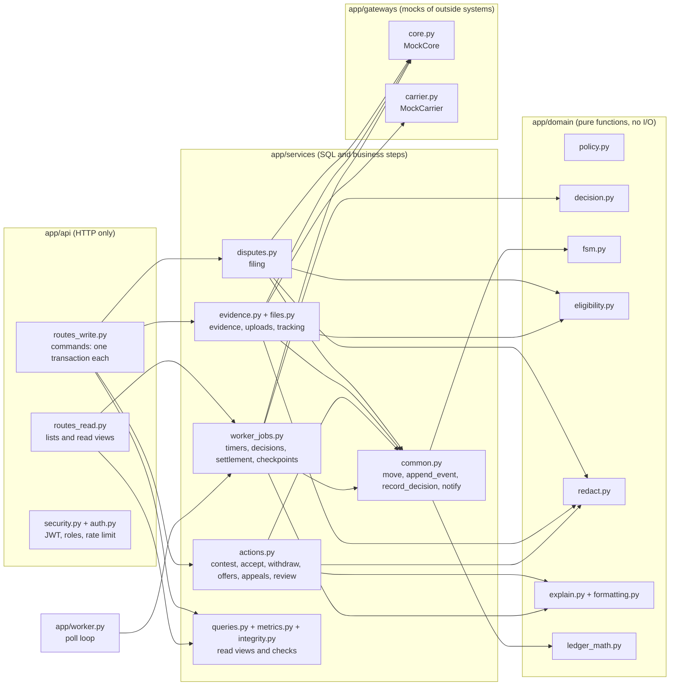

**Dependency rules:**

1. `app/domain` imports only the standard library, PyYAML and `cryptography`. No database, no HTTP, no clock, no randomness; the current time is passed in.
2. `app/services` holds all business SQL. Functions called by the api run **inside** the caller's transaction and never commit. The worker's three loop steps (`process_one_job`, `relay_one_outbox`, `maybe_auto_checkpoint`) each own one short transaction.
3. `app/api` only translates HTTP to service calls: a write route opens exactly one transaction (`run_command`) around one service function, then renders the role-scoped view.
4. External systems are reached only through `app/gateways`.

### 6.5 Request lifecycle (every write)

1. Caddy terminates TLS and forwards to `api`.
2. Middleware assigns a `request_id`, checks maintenance mode, starts a timer, and on the way out adds security headers and writes one JSON access-log line.
3. `get_principal` validates the JWT (async JWKS cache) and applies the per-user rate limit. A flat per-audience dependency (`cardmember_only`, `merchant_only`, `party_only`, `reviewer_only`, `auditor_only`, `staff_only`, `any_role`) checks the role.
4. A strict Pydantic model validates the input (`extra="forbid"`, lengths, enums).
5. One transaction, one service function: lock the dispute row (`FOR UPDATE` plus the ownership predicate) → apply pure domain logic → write rows → append ledger events (locking `ledger_head` **last**) → create notifications → commit (or roll everything back).
6. `render` re-reads the dispute and builds the role-scoped view with its status explanation.
7. Errors become RFC 9457 problems. Nothing sensitive is echoed.

### 6.6 Transactions and locking

| Rule | Why |
|---|---|
| One command = one database transaction | State, evidence, decision, ledger event, job and notification commit together or not at all |
| Lock order: `disputes` row → `settlement_offers` row → `ledger_head` | A fixed order prevents deadlocks |
| State changes use `SELECT … FOR UPDATE` on the dispute | Concurrent actions run one after another; the loser sees the new state and gets `409` (10 concurrent contests → 1 success, 9 × `409`) |
| Ledger appends lock the single `ledger_head` row | A linear chain that never forks (29 concurrent transitions → the chain verifies) |
| Uniqueness is enforced by constraints and caught as `409` | A concurrent duplicate filing is `409 dispute-exists`, never `500` |
| READ COMMITTED plus explicit row locks | No reliance on SERIALIZABLE retries |

### 6.7 Filing (with the fast path)

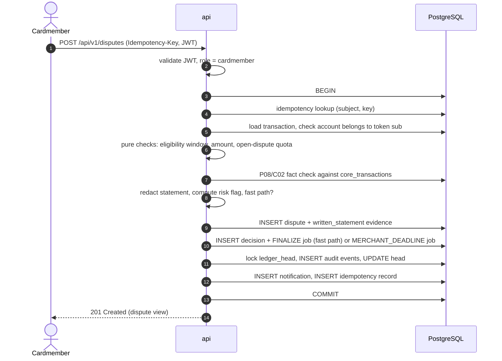

### 6.8 Contest → rebuttal → decision

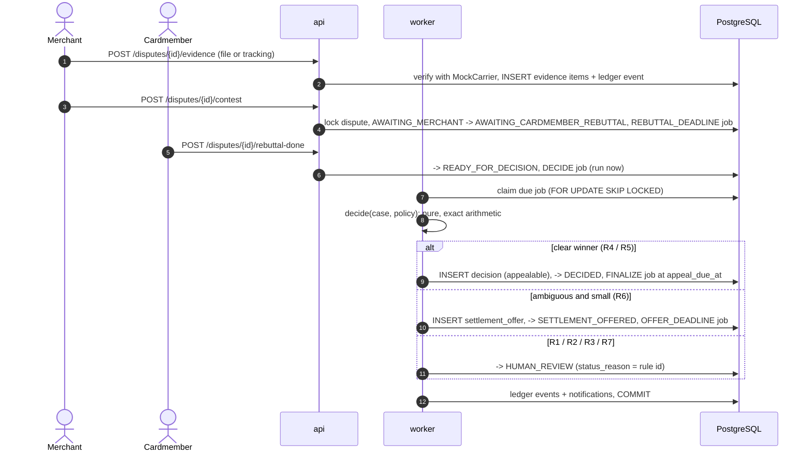

### 6.9 Settlement: the transactional outbox

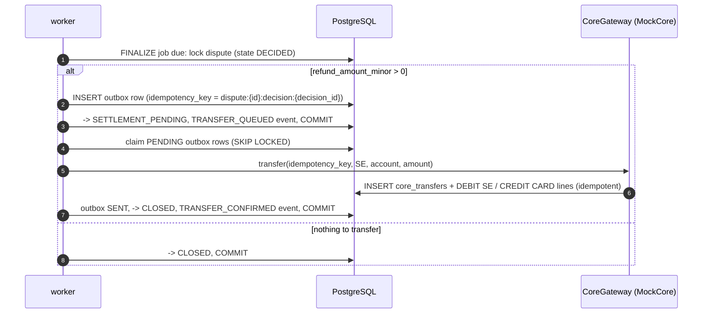

Because the same idempotency key is sent on every attempt, a retry after a crash can never move money twice. Failed transfers back off `min(2ⁿ, 300)` s. After 10 attempts the row becomes `DEAD` and reviewers are notified. There are no provisional credits, so there are no reversals, collections or charge-offs.

### 6.10 The worker loop

Every second: claim and run due jobs (one transaction each) → relay pending transfers → create a checkpoint if 100 events have accumulated → touch the heartbeat file. It is safe to run several workers at once: `FOR UPDATE SKIP LOCKED` hands each due job to exactly one of them (3 workers × 60 jobs → each processed once, T-CONC-03).

---

## 7. Tamper-evident audit ledger

Every significant change (`DISPUTE_CREATED`, `EVIDENCE_ADDED`, `STATE_CHANGED`, `DECISION_RECORDED`, `OFFER_CREATED`, `OFFER_RESPONDED`, `APPEAL_FILED`, `TRANSFER_QUEUED`, `TRANSFER_CONFIRMED`) appends an event **in the same transaction** as the change itself. Payloads contain only identifiers, codes, amounts, basis points, exact decimal strings and SHA-256 digests. They never contain names, statements, notes, addresses or file contents.

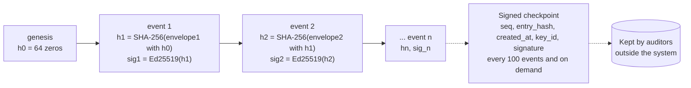

### 7.1 Construction

```text
canon(x)   = JSON, keys sorted, no whitespace, UTF-8, ASCII keys, floats rejected (matches RFC 8785 for such data)
ts_n       = UTC time as YYYY-MM-DDTHH:MM:SS.ffffffZ   (stored exactly as hashed)
h_0        = "0" x 64
h_n        = SHA-256( canon([ "apexresolve-ledger-v2", n, h_{n-1}, dispute_id_n, event_type_n,
                              actor_n, ts_n, payload_canonical_n ]) )
sig_n      = Ed25519_sign(signing_key[key_id_n], h_n)
checkpoint = { seq, entry_hash = h_seq, created_at, key_id,
               signature = Ed25519_sign(key, SHA-256(canon(["apexresolve-checkpoint-v2", seq, h_seq, created_at]))) }
```

- **Every hashed field is stored**, so anyone can recompute the chain. The domain-separation string keeps this hash apart from every other use of SHA-256.
- Appends are **serialized** by locking the single `ledger_head` row. `UNIQUE(prev_hash)` is a second guard against forks.
- The **private key never enters the database**, the logs or the image. It is a file in a read-only Docker volume (prototype) or a KMS/HSM key (production path). Public keys live in `ledger_keys` and are served at `GET /api/v1/audit/public-keys`.
- The tables are **append-only**: triggers reject `UPDATE`/`DELETE` (and `TRUNCATE` on `audit_events`) even for the owner, and the app role has no such grants.

### 7.2 Verification

```text
expected_prev <- h_0 ; expected_seq <- 1
for each stored event e in seq order:
    require e.seq       = expected_seq                              (no gaps, no reordering)
    require e.prev_hash = expected_prev                             (links intact)
    require recompute_h(e) = e.entry_hash                           (content unchanged)
    require Ed25519_verify(pk[e.key_id], e.entry_hash, e.signature) (written by the key holder)
if a checkpoint is supplied:
    require its signature verifies, and the stored event at cp.seq has entry_hash = cp.entry_hash
```

Verification is available to auditors in the API and web console, and as an independent CLI ([`backend/scripts/verify_ledger.py`](backend/scripts/verify_ledger.py)) that needs only **read** access and the public keys. Verifying 10,000 events takes well under the 10-second target (T-PERF-03).

### 7.3 What it guarantees

| Attack | Detected? | Why |
|---|---|---|
| Edit any stored field of an event | ✅ Yes | Hash mismatch (SHA-256 collision resistance) |
| Delete or reorder middle events | ✅ Yes | Sequence gap or broken link |
| Rewrite history and re-hash | ✅ Yes, unless the attacker holds the signing key | Ed25519 signatures cannot be forged |
| Truncate the tail / restore an old backup | ✅ Yes, relative to any checkpoint an auditor holds | Checkpoint comparison |
| An insider with the signing key rewrites everything after the last external checkpoint | ⚠️ Only up to that checkpoint | Hence frequent checkpoints, plus KMS custody and WORM storage in production |
| Concurrent writers forking the chain | 🚫 Prevented | Head-row lock, plus `UNIQUE(prev_hash)` |

HMAC was deliberately **not** used: with a symmetric key, anyone able to verify can also forge. A blockchain was not used either: the goal is tamper-evidence for one operator, not consensus between strangers.

### 7.4 See it detect tampering

```bash
make verify-ledger     # OK: N entries verified
make demo-tamper       # DEMO ONLY: an "insider" flips the verdict of the latest decision in the database
make verify-ledger     # FAILS: hash mismatch at seq N (points at the exact event)
make demo-truncate     # DEMO ONLY: deletes the last 3 events and rewinds the head
                       # verifying against a previously downloaded checkpoint then reports the truncation
make demo-reset        # back to a clean, reseeded database
```

The demo attack scripts refuse to run when `APP_ENV=prod`.

---

## 8. Data model

PostgreSQL 16 is the only store: there is no SQLite fallback anywhere, and tests use a real PostgreSQL too. The complete schema is one plain SQL migration, [`backend/migrations/0001_initial.sql`](backend/migrations/0001_initial.sql), applied by a ~40-line runner that records each file's SHA-256 and refuses edited files.

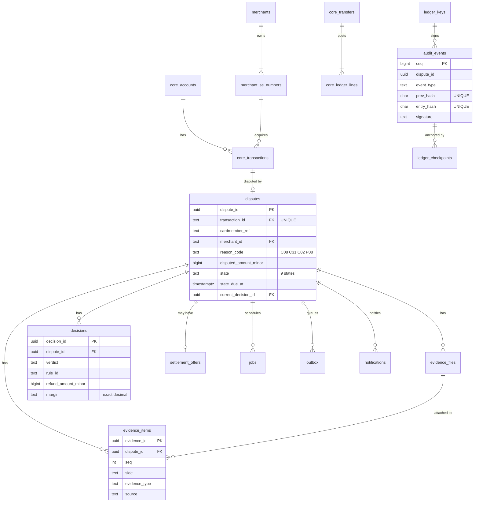

### 8.1 Principles

1. **Two database roles.** `apex_owner` owns the schema and runs migrations and seeds. `apex_app` is used at runtime by the api and worker: **no DELETE, no DDL**, and read-only access to the mock-core reference tables.
2. **Money** is `BIGINT` minor units plus a `CHAR(3)` ISO 4217 currency, with `CHECK (… >= 0)`. **Time** is `TIMESTAMPTZ` (UTC).
3. **History is append-only:** `evidence_items`, `evidence_files`, `decisions`, `audit_events`, `ledger_checkpoints`, `core_ledger_lines`.
4. **Facts are copied at filing** (amount, SE number, dates) into `disputes`, so every case is self-contained and auditable even if the source changes later.
5. **Enumerations are `TEXT` + `CHECK`.** Business timestamps are written from the `now` the service was given, never from the database clock, so tests can move time.

### 8.2 Tables (19)

| Group | Table | Purpose |
|---|---|---|
| Mock Amex core | `core_accounts` | Card accounts: `account_token` is a vault token (never a PAN); display mask = BIN + last four |
| | `merchants`, `merchant_se_numbers` | Merchant organisations and their SE numbers |
| | `core_transactions` | CHARGE and CREDIT records (a CREDIT references its charge) |
| | `core_transfers`, `core_ledger_lines` | The mock posting system: unique idempotency key; exactly one DEBIT and one CREDIT per transfer |
| Dispute engine | `disputes` | One row per dispute (one per transaction, ever): copied facts, state, due time, flags, current decision |
| | `evidence_files`, `evidence_items` | Uploaded files (with SHA-256) and typed evidence (side, source, redacted note, structured details) |
| | `decisions` | Every decision ever made, with exact V_M/V_CM/margin strings, rule, policy version and explanation |
| | `settlement_offers` | At most one offer per dispute, with both responses |
| | `jobs`, `outbox`, `notifications`, `idempotency_keys` | Durable timers, pending transfers, in-app messages, stored filing replies |
| Audit ledger | `ledger_keys`, `ledger_head`, `audit_events`, `ledger_checkpoints` | Public keys, the single head row, the signed chain, signed checkpoints |

### 8.3 Integrity checks

`make check-integrity` runs five reconciliation queries. Each must return **no rows**:

1. Every transfer has exactly one DEBIT and one CREDIT of the same amount (double entry).
2. Every closed dispute whose current decision refunds money was paid **exactly once**, for exactly that amount.
3. The current decision of every dispute belongs to that dispute.
4. The ledger head matches the last event.
5. Every waiting state has a pending timer.

### 8.4 Retention (documented; automated purge is a v2.1 item)

| Data | Kept after the dispute closes |
|---|---|
| Evidence files and redacted notes | 2 years (the ledger keeps only digests, so verification still works) |
| Disputes, decisions, offers | 7 years (financial record) |
| Audit events and checkpoints | 7 years or the longer legal requirement; never purged in v2.0 |
| Notifications; finished jobs and outbox rows | 90 days |
| Idempotency keys | 7 days |

---

## 9. API reference

### 9.1 Conventions

| Topic | Rule |
|---|---|
| Base path | `/api/v1` (health checks at the root) |
| Authentication | `Authorization: Bearer <JWT>` on every `/api/v1` endpoint |
| Money | Integer `*_minor` fields plus `currency`. Never floats |
| Scores | Exact decimal **strings**, e.g. `"v_m": "0.85675"` |
| Time | RFC 3339 UTC, e.g. `2026-09-26T10:15:30.123456Z` |
| Unknown fields | Rejected (`422`) on every JSON body (`extra="forbid"`) |
| Errors | RFC 9457 `application/problem+json` with a stable `type` slug and a `request_id` |
| Pagination | Keyset cursor on `GET /disputes` (`limit` 1–100, default 50); `after_seq` on `GET /audit/events` |
| Idempotency | `Idempotency-Key` (8–100 characters) **required** on `POST /disputes` |
| Rate limits | 120 requests/min per user; ≤ 10 filings per cardmember per rolling 24 h → `429` + `Retry-After` |

### 9.2 Endpoints and roles

| Method | Path | Purpose | 👤 CM | 🏪 Merchant | 🧑‍⚖️ Reviewer | 🔍 Auditor |
|---|---|---|---|---|---|---|
| GET | `/healthz` | Process alive (no auth) | · | · | · | · |
| GET | `/readyz` | Database reachable; reports the policy version (no auth) | · | · | · | · |
| GET | `/api/v1/me/transactions` | My charges (last 180 days) | ✔ own | — | — | — |
| POST | `/api/v1/disputes` | File a dispute | ✔ | — | — | — |
| GET | `/api/v1/disputes` | List disputes (scoped, keyset pagination) | ✔ own | ✔ own org | ✔ all | ✔ all |
| GET | `/api/v1/disputes/{dispute_id}` | Role-scoped dispute view | ✔ own | ✔ own org | ✔ | ✔ metadata |
| GET | `/api/v1/disputes/{dispute_id}/timeline` | Timeline from ledger events | ✔ own | ✔ own org | ✔ | ✔ |
| POST | `/api/v1/disputes/{dispute_id}/evidence` | Add one evidence item (multipart) | ✔ own | ✔ own org | — | — |
| GET | `/api/v1/disputes/{dispute_id}/files/{file_id}` | Download a file (attachment) | ✔ own | ✔ own org | ✔ | — |
| POST | `/api/v1/disputes/{dispute_id}/withdraw` | Withdraw | ✔ own | — | — | — |
| POST | `/api/v1/disputes/{dispute_id}/rebuttal-done` | Nothing more to add | ✔ own | — | — | — |
| POST | `/api/v1/disputes/{dispute_id}/contest` | Contest (needs merchant evidence) | — | ✔ own org | — | — |
| POST | `/api/v1/disputes/{dispute_id}/accept` | Accept (refund) | — | ✔ own org | — | — |
| POST | `/api/v1/disputes/{dispute_id}/offer-response` | `ACCEPTED` or `DECLINED` | ✔ own | ✔ own org | — | — |
| POST | `/api/v1/disputes/{dispute_id}/appeal` | Appeal (20–1,000 characters) | ✔ own | ✔ own org | — | — |
| GET | `/api/v1/review/queue` | `HUMAN_REVIEW` cases, oldest first | — | — | ✔ | — |
| POST | `/api/v1/disputes/{dispute_id}/review-decision` | Verdict, split amount, rationale | — | — | ✔ | — |
| GET | `/api/v1/audit/events` | Raw ledger rows | — | — | — | ✔ |
| POST | `/api/v1/audit/verify` | Verify the chain (optionally against a checkpoint) | — | — | — | ✔ |
| POST | `/api/v1/audit/checkpoints` | Create a signed checkpoint | — | — | — | ✔ |
| GET | `/api/v1/audit/checkpoints/latest` | Latest checkpoint | — | — | — | ✔ |
| GET | `/api/v1/audit/public-keys` | Ed25519 public keys | — | — | — | ✔ |
| GET | `/api/v1/metrics/summary` | Metrics for a date range | — | — | ✔ | ✔ |
| GET | `/api/v1/notifications` | My notifications (newest 100) | ✔ | ✔ | ✔ | ✔ (always empty) |
| POST | `/api/v1/notifications/{notification_id}/read` | Mark one read | ✔ | ✔ | ✔ | ✔ |
| GET | `/api/v1/policy` | The active policy (transparency) | ✔ | ✔ | ✔ | ✔ |

"—" → `403 forbidden`. "own" / "own org" → anything else is `404 not-found`, identical to a missing resource. The route inventory is locked by a test (T-SEC-13), and **no route can trigger a decision, timer or settlement**.

**Role-scoped views.** Responses are allow-lists per role: the card display mask only for the cardmember and reviewers; `risk_flag` only for staff; party-written notes and appeal reasons never for auditors (who get metadata and SHA-256 digests); reviewer identities are shown to parties as `REVIEWER`.

### 9.3 Errors

<details>
<summary><b>Problem types (<code>urn:apexresolve:problem:&lt;type&gt;</code>)</b></summary>

| Type | Status | When |
|---|---|---|
| `validation-error` | 422 | Wrong type, missing or unknown field, out of range. Lists `{field, type}` only, **never the submitted value** |
| `bad-request` | 400 | A multipart upload whose framing cannot be parsed |
| `unauthorized` | 401 | Missing or invalid token |
| `forbidden` | 403 | Role not allowed for this endpoint |
| `not-found` | 404 | Missing **or not yours** |
| `illegal-state` | 409 | Transition not allowed from the current state |
| `dispute-exists` | 409 | A dispute already exists for the transaction |
| `appeal-not-allowed` | 409 | Not appealable, window closed, or appeal already used |
| `offer-already-answered` | 409 | Second response by the same party |
| `idempotency-key-required` | 400 | Missing `Idempotency-Key` |
| `idempotency-key-invalid` | 422 | Key shorter than 8 or longer than 100 characters |
| `idempotency-key-reuse` | 422 | Same key, different body |
| `not-a-charge` | 422 | The transaction is a CREDIT |
| `amount-invalid` | 422 | Disputed amount above the transaction amount |
| `too-many-open-disputes` | 422 | Open-dispute quota (5) reached |
| `evidence-not-allowed` | 422 | Type, kind, side or state combination not allowed |
| `evidence-limit-reached` | 422 | 20 items for this side |
| `evidence-required` | 422 | Contest without any merchant evidence |
| `unsupported-carrier` | 422 | Carrier not supported |
| `file-too-large` | 413 | More than 5 MiB |
| `unsupported-file-type` | 415 | Not PDF, JPEG or PNG by magic bytes |
| `rate-limited` | 429 | `Retry-After: 60` (per-minute limit) or `3600` (daily filing quota) |
| `internal-error` | 500 | Generic; details only in the server log, by `request_id` |
| `maintenance` | 503 | `MAINTENANCE_MODE=true`: writes refused, reads keep working |

</details>

### 9.4 Example session (C08, merchant wins)

```text
POST /idp/token {"username":"cm-asha","password":"<demo password>"}          → token A
POST /api/v1/disputes  (A, Idempotency-Key: 3b2f…)  {"transaction_id":"TXN-C08-OK", "reason_code":"C08",
     "disputed_amount_minor":499900, "statement":"Never arrived"}              → 201 AWAITING_MERCHANT
POST /idp/token {"username":"mer-acme", …}                                   → token M
POST /api/v1/disputes/{id}/evidence (M) kind=shipment_tracking carrier=BLUEDART tracking_number=AWB10000001
                                                                             → 201 carrier_delivery_confirmation · system_verified
POST /api/v1/disputes/{id}/contest (M)                                       → 200 AWAITING_CARDMEMBER_REBUTTAL
POST /api/v1/disputes/{id}/rebuttal-done (A)                                 → 200 READY_FOR_DECISION
  … worker (≤ 5 s) …
GET  /api/v1/disputes/{id} (A)                                               → DECIDED, MERCHANT_UPHELD, R4, margin "0.855", appealable
  … 5 days later, FINALIZE: refund 0 → CLOSED
```

<details>
<summary><b>A dispute view as the cardmember sees it (role-scoped JSON, abridged)</b></summary>

```json
{
  "dispute_id": "8f1c2b1e-4d1a-4f8e-9f3a-6a1b2c3d4e5f",
  "reason_code": "C08",
  "state": "DECIDED",
  "state_due_at": null,
  "status_reason": null,
  "status_explanation": null,
  "claim_received_at": "2026-09-26T09:12:44.000000Z",
  "filing_deadline_at": "2027-01-19T18:30:00.000000Z",
  "disputed_amount_minor": 499900,
  "currency": "INR",
  "transaction": {
    "transaction_id": "TXN-C08-OK", "merchant_name": "Acme Electronics", "amount_minor": 499900,
    "transaction_at": "2026-09-14T08:00:00.000000Z", "order_ref": "ORD-7781", "card_display_mask": "371449*****8431"
  },
  "fact_check_result": null,
  "evidence": [
    {"seq": 2, "side": "MERCHANT", "submitted_by": "SYSTEM", "evidence_type": "carrier_delivery_confirmation",
     "source": "system_verified", "details": {"carrier": "BLUEDART", "tracking_number": "AWB10000001",
     "carrier_status": "DELIVERED", "postcode_match": true, "triggered_by": "MERCHANT"}}
  ],
  "decision": {
    "verdict": "MERCHANT_UPHELD", "rule_id": "R4_MERCHANT_EVIDENCE_STRONGER", "refund_amount_minor": 0,
    "v_m": "0.9", "v_cm": "0.045", "margin": "0.855", "decided_by": "SYSTEM", "appealable": true,
    "appeal_due_at": "2026-10-01T09:14:02.000000Z",
    "explanation": "The merchant's evidence was clearly stronger: merchant 90% vs cardmember 4.5%. Merchant evidence considered: carrier delivery confirmation (verified by system). The charge stands."
  },
  "offer": null,
  "allowed_actions": ["appeal"],
  "policy_version": "2026.09.1",
  "appeal_reason": null
}
```

</details>

### 9.5 Development identity provider

Available only when `APP_ENV` is `dev`, `test` or `demo`, and served under `/idp`:

| Endpoint | Behaviour |
|---|---|
| `POST /idp/token` `{"username", "password"}` | An RS256 JWT (1 hour) for a seeded demo user; `401` otherwise |
| `GET /idp/jwks.json` | The current public key (the key lives in memory and changes on every restart) |

Claims: `iss`, `aud` (`apexresolve-api`), `sub`, `role`, `merchant_id` (merchants only), `name`, `iat`, `exp`. All demo users share one password from `DEVIDP_DEMO_PASSWORD` (≥ 12 characters, no default). Passwords are compared in constant time.

---

## 10. Security and privacy

> [!WARNING]
> ApexResolve is **designed** to keep the application out of card-number scope and to support data-protection obligations, but it has **not** been assessed or certified against PCI DSS, the DPDP Act or any other standard. A real deployment needs review by qualified legal, compliance and security professionals.

### 10.1 Threat model (STRIDE, per trust boundary)

<details>
<summary><b>18 threats and their controls</b></summary>

| # | Threat | STRIDE | Control | Tested by |
|---|---|---|---|---|
| T1 | Impersonate a merchant or cardmember with a forged token | S | JWT signature via JWKS, algorithm allow-list, `iss`/`aud`/`exp` checks | T-SEC-01…08 |
| T2 | Act on someone else's dispute | E | Ownership predicate in SQL, uniform `404`, UUID ids | T-SEC-11, 12 |
| T3 | Self-certify evidence ("verified: true") | T | The server assigns the source; carrier and core verification | T-INT-EVID-07 |
| T4 | Lie about transaction facts | T | Facts derived from core records by `transaction_id` | T-INT-FILE-03 |
| T5 | Trigger decisions early | E | No decision endpoint; FSM guards | T-SEC-13, T-UNIT-FSM-* |
| T6 | Race conditions (two contests, duplicate filing) | T | Row locks, unique constraints → `409` | T-CONC-01, 02 |
| T7 | Rewrite history in the database | T/R | Append-only triggers, no UPDATE grant, signed chain, checkpoints | T-INT-DB-02, T-UNIT-LED-* |
| T8 | Re-hash the chain after tampering | R | Ed25519 (verifiers hold only public keys); key outside the database; external checkpoints | T-UNIT-LED-03 |
| T9 | Leak personal data (PAN in a statement, echoed in errors) | I | Redaction before storage; errors never echo input; no bodies in logs | T-UNIT-RED-*, T-SEC-19, 22 |
| T10 | Malicious upload (polyglot, disguised HTML) | T/E | Magic-byte allow-list, 5 MiB cap, image re-encoding, download-only with `nosniff` | T-SEC-16, 17 |
| T11 | Denial of service (filing spam, huge uploads) | D | Rate limits, filing quota, file cap, Caddy body limit | T-SEC-21 |
| T12 | Default or leaked secrets | S/E | No defaults; startup checks; `.env` git-ignored; secret scanning in CI | T-SEC-15, CI |
| T13 | Dev IdP left on in production | S | Dev IdP refuses `APP_ENV=prod`; the api refuses the dev issuer in prod | T-SEC-14 |
| T14 | SQL injection | T | Every value is a bound parameter; SQL text is only literals from the code | Review, bandit B608 |
| T15 | XSS in the SPA | T | React escaping; `dangerouslySetInnerHTML` banned by lint; strict CSP | ESLint, CSP |
| T16 | Clickjacking / CSRF | T | `frame-ancestors 'none'`; bearer tokens in headers (no cookies) | T-SEC-18 |
| T17 | Prompt injection (only if the optional AI were enabled) | T | The model never sees user text; output validated; off by default | Design rule |
| T18 | Money moved twice | T | Outbox with a unique idempotency key; unique core transfer key | T-INT-SETTLE-05 |

</details>

### 10.2 Identity and access

- **Tokens.** Accepted: JWTs with `alg` ∈ {RS256, ES256}, a known `kid`, and `iss` = `OIDC_ISSUER`, `aud` = `OIDC_AUDIENCE`, `exp`, `iat`, `sub` present (30 s leeway). Everything else (including `alg=none`, HS256 and the classic algorithm-confusion attack, expired tokens and garbage) is `401`, never `500`. An unknown role, or a merchant token without `merchant_id`, is `403`.
- **JWKS cache.** Fetched asynchronously at startup and on an unknown `kid`, at most once per 60 s.
- **In the browser**, the access token lives **in memory only**: never in localStorage or cookies, so there is no CSRF surface.
- **Authorization.** Each route declares its audience with one small flat dependency. Every query that loads a dispute adds the ownership predicate in SQL (`AND d.cardmember_ref = :sub`, `AND d.merchant_id = :mid`), so a dispute that is not yours is simply *not found*.

### 10.3 Personal-data redaction (before storage)

Applied to every free-text field (statements, notes, appeal reasons, reviewer rationales) in this order:

| # | Pattern | Extra check | Replacement |
|---|---|---|---|
| 1 | `(?<!\d)(?:\d[ -]?){12,18}\d(?!\d)` | 13–19 digits **and Luhn-valid** | `[REDACTED_CARD]` |
| 2 | `(?<!\d)[2-9]\d{3}[ -]?\d{4}[ -]?\d{4}(?!\d)` | 12 digits **and Verhoeff-valid** (Aadhaar) | `[REDACTED_AADHAAR]` |
| 3 | `(?<!\d)\d{3}[- ]\d{2}[- ]\d{4}(?!\d)` | US SSN | `[REDACTED_SSN]` |
| 4 | `\b[A-Z]{5}[0-9]{4}[A-Z]\b` | Indian PAN card | `[REDACTED_PAN_CARD]` |
| 5 | `(?<!\d)(?:\+91[ -]?\|0)?[6-9]\d{4}[ -]?\d{5}(?!\d)` | Indian mobile | `[REDACTED_PHONE]` |
| 6 | `[A-Za-z0-9._%+-]+@[A-Za-z0-9.-]+\.[A-Za-z]{2,}` | e-mail | `[REDACTED_EMAIL]` |
| 7 | `\b[A-Za-z0-9._-]{2,256}@[A-Za-z]{2,64}\b` | UPI id (after e-mail) | `[REDACTED_UPI]` |

**Why checksums:** without them, ordinary 16-digit order numbers get redacted and evidence is destroyed. With Luhn, 9 out of 10 random digit strings pass through untouched, while real card numbers are redacted in every common format (spaced, dashed, contiguous). Tracking and order numbers are entered in **structured fields**, which are validated and never redacted. **Known limit:** names, street addresses and bank account numbers are not detected (no NER), so the UI warns under every text box: *"Do not include card numbers, Aadhaar or PAN numbers, phone numbers or bank details."*

### 10.4 Hardening checklist

| Control | Setting |
|---|---|
| API response headers | `X-Content-Type-Options: nosniff`, `Referrer-Policy: no-referrer`, `Cache-Control: no-store`, `Content-Security-Policy: default-src 'none'; frame-ancestors 'none'`, `X-Request-Id` |
| SPA headers (Caddy) | `default-src 'self'; script-src 'self'; style-src 'self'; img-src 'self' data: blob:; connect-src 'self'; object-src 'none'; base-uri 'none'; frame-ancestors 'none'; form-action 'self'`, HSTS, `Permissions-Policy`, `Server` header removed |
| CORS | Only the exact origins in `CORS_ORIGINS`; no wildcard; no credentials |
| API docs | `/docs` and `/openapi.json` disabled when `APP_ENV=prod` |
| Body limits | Caddy caps every request at 6 MB; text fields have maximum lengths; files ≤ 5 MiB |
| Uploads | Magic bytes (`%PDF-`, `FF D8 FF`, `89 50 4E 47 0D 0A 1A 0A`); Pillow re-encode strips EXIF and neutralises polyglots, with a decompression-bomb limit; downloads as `attachment` |
| Logging | One JSON line per request: `request_id`, method, **route template** (never the raw path or query), status, duration and a 16-hex-character SHA-256 pseudonym of the user. Errors log type and location, never the message. **Never logged:** bodies, headers, tokens, statements, notes, file names |
| Database | `apex_app`: no DELETE, no DDL, no write access to reference data; append-only triggers fire even for the owner; the database port is never published |
| Containers | Non-root user (uid 10001), code owned by root, `read_only` api and worker containers, signing key mounted read-only |
| Secrets | Environment variables or files only; **no defaults**; startup names the bad variable but never prints its value; `.env` git-ignored |

### 10.5 Compliance posture (prototype)

| Topic | Position |
|---|---|
| **PCI DSS v4.0.x** | The application never receives, stores or displays full PANs; accounts are vault tokens; masks show BIN + last four; free-text PANs are redacted. We say *"designed to keep the application out of PAN scope"*, **not** "PCI compliant". |
| **Card-network rules** | The 120-day filing window (with the C08 expected-delivery anchor) and the 20-day merchant response are modelled from Amex's published merchant guidance as network rules, not statutes. The two-stage inquiry → chargeback process is simplified to one window. |
| **US Regulation Z §1026.13** (context) | The statutory billing-error clock is **not** automated. A production issuer would add regulatory clocks per jurisdiction. |
| **RBI payment-data storage directive (2018)** | Deploy in an Indian region. No third-party processing of dispute data. |
| **India DPDP Act 2023** | Notice at filing, purpose limitation, documented retention limits. Access and erasure requests are handled manually in the prototype. |
| **Automated decisions** | Every automated decision is explained, appealable and reviewable by a person. High-value and flagged cases are always decided by people. |

---

## 11. Web application

A small React + TypeScript single-page app ([`web/src`](web/src)): one API module (the only place with `fetch`), one formatting module, one data hook, one stylesheet. There is no router, state library, UI kit or CSS framework; the current screen is a piece of state.

| # | Screen | Role | Highlights |
|---|---|---|---|
| S1 | Sign-in (`Login.tsx`) | all | Demo-user picker plus the demo password; the disclaimer is always visible |
| S2 | My charges + file a dispute (`CardmemberHome.tsx`) | cardmember | Plain-language reasons, amount defaulting to the full charge, character counter, privacy warning, a per-form idempotency key |
| S3 | Dispute lists (`DisputeList.tsx`) | cardmember, merchant, reviewer | Merchants' queue sorted by the next due time |
| S4 | Dispute detail (`DisputeDetail.tsx`, `EvidenceForm.tsx`) | all | Facts, decision card, offer, the actions allowed now, evidence (with downloads), add evidence (built from the policy catalogue), timeline |
| S5 | Review queue (`ReviewQueue.tsx`) | reviewer | Waiting since, reason, amount, why a person, scores; decision form |
| S6 | Ledger integrity (`AuditConsole.tsx`) | auditor | Ledger table, **Verify chain**, verify against a checkpoint file, create and download checkpoints |
| S7 | Metrics (`Metrics.tsx`) | reviewer, auditor | Rates for a date range, disputes by status now |
| S8 | Notifications (`Notifications.tsx`) | cardmember, merchant, reviewer | Unread count, 15 s polling, opening one marks it read |

**UI principles**

- **Plain language first.** States, reasons and events have human labels ("Waiting for the merchant · next step due 16 Oct 2026, 02:30 pm IST"). Rule ids appear only in the decision card's small print.
- **Money** is shown as `₹1,23,456.78` (Indian digit grouping) using **integer arithmetic**, and typed amounts are parsed from digits, never through floats. **Times** are shown in IST.
- **The UI never decides anything.** Buttons come from the server's `allowed_actions`, the server re-checks every action, and a `409` is shown rather than hidden.
- **Live without WebSockets.** Notifications poll every 15 s. A dispute screen refreshes every 3 s only while the worker is deciding or settling.
- **Safe by default.** The token lives in memory, so a reload means signing in again. Nothing is rendered as HTML. The CSP forbids inline styles and scripts.

---

## 12. Technology stack

| Layer | Technology | Version | Why this and not something bigger |
|---|---|---|---|
| Language (backend) | Python | 3.12 | Readable, strong standard library (`fractions`, `zoneinfo`, `hashlib`) |
| Web framework | FastAPI + Starlette | 0.141 / 1.7 | Typed request validation with Pydantic, async, OpenAPI |
| ASGI server | Uvicorn | 0.54 | The standard server for FastAPI |
| Database | PostgreSQL | 16 | Row locks, `SKIP LOCKED`, `CHECK` constraints, triggers: the database does the hard concurrency work |
| Database access | SQLAlchemy 2 Core `text()` + asyncpg | 2.1 / 0.31 | Plain, parameterised SQL with pooling and transactions, without an ORM |
| Validation / settings | Pydantic v2, pydantic-settings | 2.13 / 2.15 | Strict request models; environment settings validated at startup |
| Tokens / crypto | PyJWT[crypto], cryptography | 2.15 / 50.0 | RS256/ES256 validation against a JWKS; Ed25519 ledger signatures |
| HTTP client | httpx | 0.28 | Fetch the JWKS; in-process test client |
| Images | Pillow | 12.3 | Re-encode uploads to strip EXIF and neutralise polyglots |
| Policy | PyYAML (`safe_load`) | 6.0 | One human-readable policy file |
| Tests | pytest, hypothesis, pgserver, pytest-cov, Playwright | 9.1 / 6.168 / 0.1.4 / 7.1 / 1.63 | A real PostgreSQL without Docker; property tests; browser tests |
| Quality | ruff, bandit, pip-audit | 0.16 / 1.9 / 2.10 | Lint and bug patterns, security patterns, vulnerable dependencies |
| Web app | React + TypeScript + Vite | 19.3 / 6.0 / 8.3 | A small SPA served as static files |
| Web quality | ESLint (+ react-hooks), `tsc --strict` | 10.11 | Type safety and hook correctness |
| Edge | Caddy | 2 | Automatic HTTPS, reverse proxy, static files and security headers in ~40 lines |
| Packaging | Docker, Docker Compose | — | One command to run everything on one host |

**Deliberately not used:** an ORM, Alembic, Celery, Redis, Kafka, Kubernetes, GraphQL, WebSockets, Next.js, a router or state library, CSS frameworks, and any machine-learning model or LLM in the decision path. The [decision memo](#20-decision-memo) explains each choice.

Exact versions are pinned in [`backend/requirements.lock`](backend/requirements.lock), [`backend/requirements-dev.lock`](backend/requirements-dev.lock) and [`web/package-lock.json`](web/package-lock.json), and Dependabot proposes updates weekly.

---

## 13. Repository layout

```text
.
├── .env.example                 configuration template (every secret empty, no defaults)
├── .github/
│   ├── dependabot.yml           weekly dependency updates
│   └── workflows/ci.yml         CI gates: backend, web, e2e, secrets, images
├── Makefile                     every day-to-day command (make help)
├── README.md
├── backend/
│   ├── app/
│   │   ├── api/                 HTTP only: errors, read routes, write routes, schemas, security
│   │   ├── domain/              pure rules: decision, eligibility, explain, formatting, fsm, ledger_math, policy, redact
│   │   ├── gateways/            MockCore (Amex core records, transfers) and MockCarrier (tracking)
│   │   ├── services/            SQL + business steps: actions, common, disputes, evidence, files,
│   │   │                        integrity, metrics, queries, worker_jobs
│   │   ├── auth.py              JWT + JWKS validation
│   │   ├── bootstrap.py         startup wiring (policy, signing key, engine, public keys)
│   │   ├── logs.py              JSON logs without personal data
│   │   ├── main.py              api app factory, /healthz, /readyz
│   │   ├── settings.py          validated configuration (no default secrets)
│   │   └── worker.py            the background loop
│   ├── devidp/                  development-only token issuer + demo users (no passwords inside)
│   ├── fixtures/carrier.json    mock carrier data
│   ├── migrations/              0001_initial.sql: the complete schema, grants and triggers
│   ├── scripts/                 migrate, seed_demo, make_ledger_key, verify_ledger, check_integrity,
│   │                            demo_ledger_attack, gen_golden, simulate
│   ├── seed/demo_seed.json      synthetic merchants, accounts, transactions, carrier fixtures, demo users
│   ├── tests/                   unit, property, golden, integration, concurrency and browser tests
│   ├── pyproject.toml           dependencies, pytest and ruff settings
│   ├── requirements.lock        pinned runtime dependencies
│   └── requirements-dev.lock    pinned development dependencies
├── deploy/
│   ├── Caddyfile                TLS, SPA, reverse proxy, security headers
│   ├── Dockerfile.backend       one image for api, worker, devidp, migrate, seed (non-root)
│   ├── Dockerfile.web           Vite build → Caddy
│   ├── db-init/00_roles.sh      creates apex_owner, apex_app and the database from .env
│   └── docker-compose.yml       every service on one host
├── policy/
│   └── policy.2026.09.1.yaml    every number the engine uses
└── web/
    ├── src/
    │   ├── App.tsx              sign-in gate, header with disclaimer, one screen at a time
    │   ├── api.ts               the only fetch; token in memory; RFC 9457 handling
    │   ├── format.ts            integer money formatting/parsing, IST dates, labels
    │   ├── types.ts             mirrors the API views
    │   ├── useData.ts           the one data-loading hook
    │   ├── styles.css           the only stylesheet
    │   └── pages/               Login, CardmemberHome, DisputeList, DisputeDetail, EvidenceForm,
    │                            ReviewQueue, AuditConsole, Metrics, Notifications
    ├── package.json · package-lock.json · tsconfig.json · vite.config.ts · eslint.config.js · index.html
```

---

## 14. Getting started

### 14.1 Prerequisites

| Tool | Version | Needed for |
|---|---|---|
| Docker Engine + Compose v2 (or Docker Desktop) | recent | Running the whole system (`make demo`) |
| GNU make | any | The command shortcuts (optional: every target is one plain command) |
| Python | 3.12 | Running tests and scripts locally |
| Node.js | 22 | Building and developing the web app |

### 14.2 Quick start (Docker, about 3 minutes)

```bash
git clone <this-repository> apexresolve && cd apexresolve
make env                 # creates .env from .env.example
# edit .env and fill EVERY empty value; generate each password separately with:
#   python3 -c "import secrets; print(secrets.token_urlsafe(24))"
make demo                # build images, create the ledger key, migrate, seed demo data, start everything
make ps                  # db, api, worker, devidp, web healthy; keygen, migrate, seed "exited (0)"
```

Then open **http://localhost:8080** and sign in with the demo password you put in `DEVIDP_DEMO_PASSWORD`:

| User | Role | Try this |
|---|---|---|
| `cm-asha` (Asha Verma) | Cardmember | File C08 on ORD-7781; file P08 on the second ORD-5520 (refunded at filing) |
| `cm-ravi` (Ravi Menon) | Cardmember | File C31 on ORD-8123 (offer); C02 on BK-4415 (FP3); C02 on BK-4499 (₹75,000 → human review) |
| `mer-acme` | Merchant, Acme Electronics | Add tracking `BLUEDART` / `AWB10000001` and contest |
| `mer-skyline`, `mer-pageturner` | Merchants | The other two synthetic merchants |
| `rev-neha` | Reviewer | Review queue, all disputes, metrics |
| `aud-kabir` | Auditor | Verify the chain, create and download checkpoints |

Stop with `make down` (data is kept); wipe and reseed with `make demo-reset`.

### 14.3 Local development (no Docker needed for tests)

```bash
make dev-setup      # backend/.venv from requirements-dev.lock, Playwright's Chromium, web/node_modules
make test           # 92 backend tests; pgserver starts a real PostgreSQL 16 per test module
make coverage       # the same, with the CI gates (backend >= 80 %, app/domain >= 95 %)
make e2e            # 6 browser tests: starts the dev IdP, api, worker and Vite itself
make lint security  # ruff, bandit, pip-audit
make web-check      # tsc --strict, eslint, vite build
make golden-check   # the committed golden vectors equal what the engine produces
make web-dev        # SPA with hot reload against the containers from `make demo`
```

<details>
<summary><b>Windows notes (native, without WSL)</b></summary>

The Makefile uses the Linux/macOS virtual-environment layout (`backend/.venv/bin/python`). On Windows, run the same steps directly in PowerShell:

```powershell
py -3.12 -m venv backend\.venv
# the lock file is resolved for Linux: leave out uvloop (it has no Windows build; uvicorn falls back to asyncio)
Get-Content backend\requirements-dev.lock | Where-Object { $_ -notmatch '^uvloop==' } | Set-Content $env:TEMP\req-dev-win.txt
backend\.venv\Scripts\python.exe -m pip install -r $env:TEMP\req-dev-win.txt
backend\.venv\Scripts\python.exe -m playwright install chromium
Push-Location web; npm ci; Pop-Location

$env:PYTHONUTF8 = "1"                                  # the tests read UTF-8 files
$env:PYTHONTZPATH = "C:\msys64\usr\share\zoneinfo"     # any IANA zoneinfo directory: Windows ships none
Set-Location backend
.venv\Scripts\python.exe -m pytest -q                  # 92 backend tests
$env:E2E = "1"; .venv\Scripts\python.exe -m pytest -q tests/e2e   # 6 browser tests
```

On Windows, pgserver listens on TCP rather than a Unix socket; the test harness handles both.

</details>

### 14.4 All make targets

| Target | What it does |
|---|---|
| `make help` | List the targets |
| `make env` | Create `.env` from the example (then fill in every empty value by hand) |
| `make up` | Build and start everything (no demo data) |
| `make demo` | Build and start everything, with the synthetic demo data |
| `make down` | Stop everything (data is kept) |
| `make logs` | Follow the api and worker logs |
| `make ps` | Show container health |
| `make demo-reset` | **Demo only:** wipe the database and reseed (keeps the ledger key and HTTPS certificates) |
| `make backup` | Dump the database to `backups/` (copy the file off the host afterwards) |
| `make rotate-ledger-key` | Make a new ledger key; set a **new** `LEDGER_KEY_ID` in `.env` first |
| `make verify-ledger` | Verify the whole hash chain and every signature |
| `make check-integrity` | Run the reconciliation queries (double entry, paid once, timers, ledger head) |
| `make demo-tamper` | **Demo only:** flip the verdict of the latest decision (verification must then fail) |
| `make demo-truncate` | **Demo only:** delete the last 3 ledger events (verification against a checkpoint must then fail) |
| `make dev-setup` | Create `backend/.venv` with the locked dev dependencies, and install web packages |
| `make test` | All backend tests (unit, property, integration on an embedded PostgreSQL) |
| `make coverage` | Tests with the CI coverage gates |
| `make test-unit` | Fast tests only (no database) |
| `make e2e` | Browser tests T-E2E-01…06 (screenshots go to the temp directory `apexresolve-e2e`) |
| `make lint` | ruff |
| `make security` | bandit and pip-audit |
| `make golden` | Regenerate the golden vectors (only after a reviewed policy change) |
| `make golden-check` | Fail if the committed golden vectors differ from what the engine produces |
| `make simulate` | Print the synthetic threshold-calibration table |
| `make web-dev` | Run the SPA with hot reload (proxies `/api` and `/idp` to the local containers) |
| `make web-check` | Type-check, lint and build the SPA |

---

## 15. Configuration

All configuration is **environment variables plus the policy file**, validated at startup. A missing or malformed value stops the process, and there are **no default secrets**. Start from [`.env.example`](.env.example).

| Variable | Used by | Required | Example / default | Notes |
|---|---|---|---|---|
| `APP_ENV` | all | yes | `dev`, `test`, `demo`, `prod` | `prod` disables `/docs`, refuses the dev IdP issuer, the dev IdP itself, the demo seed and the demo attacks |
| `POSTGRES_PASSWORD`, `APEX_OWNER_PASSWORD`, `APEX_APP_PASSWORD` | db init | yes | — | Used when the database volume is first created; each must be unique |
| `DEVIDP_DEMO_PASSWORD` | devidp | yes (dev/demo) | — | ≥ 12 characters; shared by all demo users |
| `LEDGER_KEY_ID` | api, worker | yes | `ledger-2026-09` | Change it on every key rotation; startup fails if the id is registered with a different key |
| `DATABASE_URL` | api, worker | yes | `postgresql+asyncpg://apex_app:…@db:5432/apex` | Set by compose; must be `postgresql+asyncpg://` with the least-privilege role |
| `MIGRATION_DATABASE_URL` | migrate, seed, demo attacks | those jobs | `postgresql://apex_owner:…@db:5432/apex` | Owner role; never given to api or worker |
| `AUDIT_DATABASE_URL` | `verify_ledger.py` | no | read-only URL | Falls back to `DATABASE_URL` |
| `POLICY_PATH` | api, worker | yes | `/app/policy/policy.2026.09.1.yaml` | Validated at startup |
| `LEDGER_SIGNING_KEY_PATH` | api, worker | yes | `/app/keys/ledger_signing_key.pem` | Ed25519 PKCS#8 PEM, mode 0600, from the `ledger_key` volume |
| `CARRIER_FIXTURES_PATH` | api, worker | no | `fixtures/carrier.json` | Mock carrier data |
| `OIDC_ISSUER`, `OIDC_AUDIENCE`, `OIDC_JWKS_URL` | api | issuer + JWKS yes | `apexresolve-devidp`, `apexresolve-api`, `http://devidp:9000/jwks.json` | A production deployment points these at its real IdP |
| `CORS_ORIGINS` | api | no | empty | Comma-separated exact origins; empty = same origin only |
| `RATE_LIMIT_PER_MINUTE` | api | no | `120` | Per signed-in user, in-process |
| `MAINTENANCE_MODE` | api | no | `false` | `true` → every write returns `503`; reads keep working |
| `SITE_ADDRESS`, `HTTP_PORT`, `HTTPS_PORT` | web (Caddy) | no | `:80`, `8080`, `8443` | Set `SITE_ADDRESS` to a domain for automatic HTTPS |
| `WORKER_HEARTBEAT_PATH` | worker | no | `run/worker-heartbeat` | Touched every loop; the container health check reads it |

**The policy file** [`policy/policy.2026.09.1.yaml`](policy/policy.2026.09.1.yaml) holds every number the rules decide with: windows (120 / 20 / 7 / 5 / 5 days), thresholds (±4000 bp), limits (₹50,000 automation, ₹2–₹10,000 offers, 5 open disputes, 10 filings per day, 20 items per side, 5 MiB, 2,000 characters), the risk settings (3 disputes in 90 days), the 72-hour duplicate window, the source reliabilities and the evidence catalogue. It contains integers only. Its version is recorded on every dispute and decision and published at `GET /api/v1/policy`. **Changing it** means a new version, regenerated golden vectors, a sensitivity report and two approvals.

---

## 16. Testing and quality

### 16.1 Test levels

| Level | What it proves | Where | Tooling |
|---|---|---|---|
| Unit | Pure functions behave exactly as specified | `backend/tests/unit` | pytest |
| Property | Laws hold for **all** inputs: monotonicity, no stacking, order independence, bounded offers | `test_decision.py` | hypothesis (2,000–3,000 cases per property) |
| Golden | The 18 normative vectors are reproduced exactly | `test_golden.py` + `tests/golden/golden_vectors.json` | pytest + CI regeneration diff |
| Integration | Services, SQL, constraints, grants, triggers, HTTP and scripts on a **real PostgreSQL 16**, as the least-privilege role | `backend/tests/integration` | pytest + pgserver + httpx ASGI transport |
| Concurrency | One winner per dispute, a linear ledger, jobs exactly once, one dispute per charge | `test_concurrency.py`, `test_concurrent_filing.py` | `asyncio.gather` on real PostgreSQL |
| Demo scenarios | Every demo scenario produces the documented outcome on the real seed | `test_demo_scenarios.py` | pytest |
| End-to-end | Real users complete real flows in a browser | `backend/tests/e2e/test_ui_e2e.py` | Playwright + Chromium against real processes |
| Static / supply chain | Code patterns, dependencies, secrets, images | CI | ruff, bandit, pip-audit, npm audit, gitleaks, trivy, tsc, eslint |

**Key rules:** tests never sleep to wait for time. Services receive `now`, so tests move the clock forward through deadlines, appeal windows, offer expiry and retries. A failing test is never "fixed" by weakening its assertion.

### 16.2 Results (last full run)

| Check | Result |
|---|---|
| Backend tests (`make test`) | ✅ **92 passed** (83 unit/property/golden + 9 integration on PostgreSQL 16) |
| Browser tests (`make e2e`) | ✅ **6 passed** (T-E2E-01…06) |
| Coverage gates | ✅ backend **92 %** (≥ 80 %) · `app/domain` **98 %** (≥ 95 %) |
| Golden vectors | ✅ 18/18 identical to the committed vectors and the specification |
| Simulator | ✅ reproduces the calibration table in [5.10](#510-threshold-calibration-synthetic) |
| ruff · bandit · pip-audit | ✅ clean · no findings · no known vulnerabilities |
| `tsc --strict` · eslint · vite build · npm audit | ✅ clean · clean · builds · 0 vulnerabilities |

<details>
<summary><b>Browser scenarios (T-E2E)</b></summary>

| ID | Verifies |
|---|---|
| T-E2E-01 | A cardmember signs in, files a C08 dispute and sees "Waiting for the merchant"; the card number typed in the statement is never shown back |
| T-E2E-02 | The merchant adds a carrier tracking number (verified delivery) and contests |
| T-E2E-03 | The cardmember finishes the rebuttal; the worker decides within seconds; decision and explanation shown (R4) |
| T-E2E-04 | A duplicate charge is refunded at filing (P08 fast path, FP1) |
| T-E2E-05 | The auditor verifies the chain and downloads a checkpoint file |
| T-E2E-06 | The reviewer sees the review queue and metrics; no uncaught script errors in the whole session |

</details>

<details>
<summary><b>Security tests (T-SEC)</b></summary>

| ID | Verifies |
|---|---|
| T-SEC-01…08 | Valid tokens accepted; forged prefix tokens, other keys, expired, wrong audience, wrong issuer, `alg=none`, HS256 (including algorithm confusion with the public key) and garbage all → `401`, never `500` |
| T-SEC-09, 10 | Unknown role / merchant without `merchant_id` → `403`; a role calling an endpoint it does not serve → `403` |
| T-SEC-11, 12 | Another organisation's or cardmember's dispute or transaction → `404` |
| T-SEC-13 | The route inventory is exactly the documented list, with no decision/timer/settlement trigger |
| T-SEC-14 | The dev IdP refuses `APP_ENV=prod` and short passwords; the api refuses the dev issuer in prod |
| T-SEC-15 | Missing or malformed settings, non-Ed25519 keys and a reused key id with another key stop startup |
| T-SEC-16, 17 | Disguised executable → `415`; > 5 MiB → `413`; images re-encoded; auditors cannot download; downloads are attachments |
| T-SEC-18 | Security headers on every API response |
| T-SEC-19 | Validation errors never echo input (a PAN in a bad field is not returned); 5xx bodies are generic |
| T-SEC-20 | CORS only for configured origins; `/docs` and `/openapi.json` off in prod |
| T-SEC-21 | 120 req/min → `429` + `Retry-After: 60`; daily filing quota → `429` + `Retry-After: 3600` |
| T-SEC-22 | JSON access logs with request id, route template, status and duration; no tokens, bodies, PANs, statements, subjects or ids |

</details>

### 16.3 Continuous integration

Every push to `main` and every pull request runs these jobs, and all of them must pass:

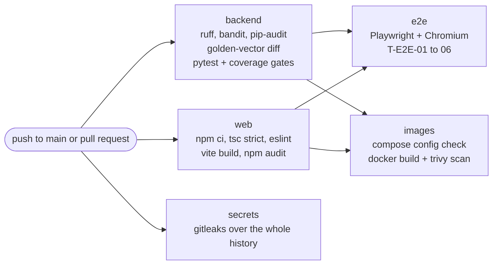

---

## 17. Deployment guide

### 17.1 Environments

| Environment | Where | `APP_ENV` | Identity | Data | Purpose |
|---|---|---|---|---|---|
| Development | Developer laptop | `dev` | Dev IdP | Demo seed | Building features; `make demo`, `make web-dev` |
| Test | CI runner / laptop | `test` | Dev IdP (in-process) | Created per test | Automated tests on embedded PostgreSQL |
| Demo | One small VM (2 vCPU, 4 GB RAM, 40 GB disk, Ubuntu 24.04) in an Indian region | `demo` | Dev IdP | Demo seed, reset before each demo | Judges and mentors |
| Production path | Not built in v2.0 | `prod` | Enterprise OIDC IdP | Real | See [17.10](#1710-production-path) |

`prod` is a **safety switch**: the dev IdP, the demo seed and the demo attack scripts all refuse to run, API docs are disabled, and the api refuses the dev issuer.

### 17.2 Host prerequisites

Any Linux with Docker Engine 24+ and the Compose v2 plugin (Docker Desktop on macOS/Windows for development); 2 vCPU, 4 GB RAM, 20 GB free disk; `git` and `make`; an NTP-synchronised clock (deadlines and ledger timestamps depend on it). For a public demo VM: inbound 80 and 443 open, plus a DNS name if you want automatic HTTPS.

### 17.3 Local deployment

```bash
make env && $EDITOR .env          # fill every password (unique, generated)
make demo                         # build, create the key, migrate, seed, start
make ps                           # everything healthy
open http://localhost:8080        # sign in as cm-asha with DEVIDP_DEMO_PASSWORD
```

### 17.4 Demo VM with HTTPS

1. Create the VM; install Docker (`curl -fsSL https://get.docker.com | sh`), `git` and `make`; add your user to the `docker` group.
2. Point a DNS name (e.g. `apexresolve-demo.example.com`) at the VM's public IP.
3. Clone the repository; `make env`; in `.env` set `APP_ENV=demo`, `SITE_ADDRESS=<your domain>`, `HTTP_PORT=80`, `HTTPS_PORT=443` and all passwords.
4. `make demo`. Caddy obtains and renews the certificate automatically (the `caddy_data` volume keeps it across restarts).
5. Check: `curl -fsS https://<your domain>/readyz` → `{"status":"ready","policy_version":"…"}`; then sign in through the browser.
6. Firewall: allow only 22 (SSH, key-based), 80 and 443. The database has no published port.

### 17.5 What starts, in order

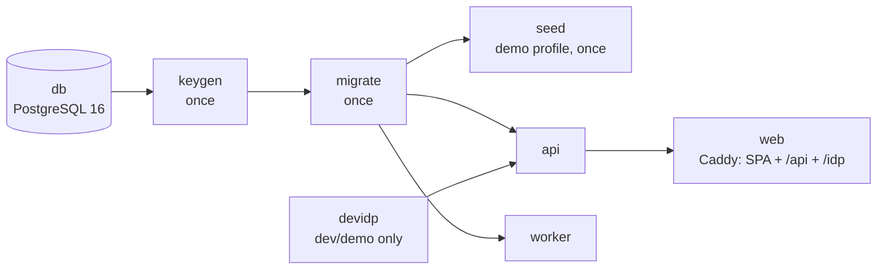

| Service | Health check | Restart policy |
|---|---|---|
| `db` | `pg_isready` every 5 s | unless-stopped |
| `keygen`, `migrate`, `seed` | exit 0 | no |
| `api` | `GET /readyz` every 10 s | unless-stopped |
| `worker` | heartbeat file younger than 30 s | unless-stopped |
| `devidp` | process up | unless-stopped |
| `web` | starts when the api is healthy | unless-stopped |

**Built-in hardening:** the backend image runs as a non-root user (uid 10001) with code owned by root; the `api` and `worker` containers are `read_only` with `tmpfs` scratch space; the Ed25519 key is created once inside a named volume (never on the host disk or in git) and mounted read-only; the database is reachable only inside the compose network; uvicorn's own access log is off because the api writes its own privacy-safe JSON log.

### 17.6 Backup and restore

The PostgreSQL database holds everything: disputes, evidence files, the ledger and transfers. The ledger's **public** keys are inside the database. The private signing key does not need a backup: if it is lost, rotate it.

```bash
make backup                                   # backups/apex-YYYYMMDD-HHMMSS.dump (custom format)
scp backups/apex-*.dump <somewhere-off-the-host>   # keep 7 daily copies, encrypted and access-controlled
```

Restore (deliberate, never automatic):

```bash
COMPOSE="docker compose --env-file .env -f deploy/docker-compose.yml"
$COMPOSE stop api worker web
$COMPOSE exec -T db dropdb -U postgres apex
$COMPOSE exec -T db createdb -U postgres -O apex_owner apex
$COMPOSE exec -T db pg_restore -U postgres -d apex --no-owner --role=apex_owner < backups/apex-<stamp>.dump
$COMPOSE exec -T db psql -U postgres -d apex -c "REVOKE ALL ON DATABASE apex FROM PUBLIC; GRANT CONNECT ON DATABASE apex TO apex_app"
$COMPOSE start api worker web
make verify-ledger && make check-integrity
```

Table grants and append-only triggers are inside the dump. The database-level `CONNECT` grant is not, which is why step 5 exists.

### 17.7 Ledger key management

| Task | Procedure |
|---|---|
| Creation | Automatic on first start: the `keygen` service writes an Ed25519 key (mode 0600) into the `ledger_key` volume |
| Registration | At startup the api and worker register the public key under `LEDGER_KEY_ID`; a known id with a different key stops startup |
| Rotation (e.g. every 6 months, or when a team member leaves) | 1. Set a **new** `LEDGER_KEY_ID` in `.env`. 2. `make rotate-ledger-key`. 3. `make verify-ledger`: old events verify with the old public key, new ones with the new key. 4. An auditor creates and downloads a checkpoint. |
| Suspected compromise | Rotate immediately; verify against the **last checkpoint held outside the system**; treat events between that checkpoint and the rotation as suspect and re-review them; record the incident |
| Loss (volume deleted) | Rotate. Nothing already written is affected. |

### 17.8 Upgrades and migrations

1. `make backup`.
2. `git pull` (the new version's CI must be green).
3. `make up`: rebuilds the images; the `migrate` service applies new migration files once, then the api and worker start.
4. `make ps`, `make verify-ledger`, `make check-integrity`.
5. Rollback = redeploy the previous tag **and** restore the backup if a migration ran (migrations are forward-only).

### 17.9 Maintenance mode

Set `MAINTENANCE_MODE=true` in `.env` and run `docker compose --env-file .env -f deploy/docker-compose.yml up -d api`. Reads keep working and every write returns `503 maintenance`. Timers keep running in the worker, so stop the worker too if the database must not change.

### 17.10 Production path

v2.0 is a prototype. Before any real cardmember data, these changes are **required**, each as a separate reviewed piece of work:

| Area | Prototype (v2.0) | Production |
|---|---|---|
| Identity | Dev IdP with a shared demo password | Enterprise OIDC (authorization code + PKCE, short-lived tokens, MFA for staff); remove `devidp` and the `/idp` Caddy block |
| Database | PostgreSQL container, `pg_dump` backups | Managed PostgreSQL in an Indian region with PITR (RPO ≤ 15 min, RTO ≤ 4 h), encryption at rest, private network only |
| Signing key | File in a Docker volume | KMS/HSM-held Ed25519 key, access-logged, with a rotation policy |
| Checkpoints | Downloaded by auditors | Also written automatically to WORM storage (e.g. S3 Object Lock, compliance mode) |
| Scale | 1 api, 1 worker, in-process rate limiter | 2+ api instances behind a load balancer (rate limiting moves to the edge), 1–2 workers (`SKIP LOCKED` already allows it) |
| Integrations | `MockCore`, `MockCarrier` | Real adapters behind the same two gateway classes; the relay calls the real posting system with the same idempotency key |
| Files | `bytea` in PostgreSQL | Object storage with encryption, malware scanning and signed downloads |
| Secrets | `.env` on the host | A secrets manager; no plain-text secret on disk |
| Observability | JSON logs on stdout | Central log store, metrics (request rate, errors, p95, job lag, DEAD outbox), on-call alerting |
| Compliance | Designed for, not assessed | DPIA under the DPDP Act 2023, PCI DSS scoping, penetration test, retention automation, incident response with named owners |
| Rules | Modelled network timelines | Legal and scheme-rules review of every window and reason-code rule |

---

## 18. Operations runbook

### 18.1 Routine checks

| When | Check | Command | Expected |
|---|---|---|---|
| Daily (demo VM) | Ledger integrity | `make verify-ledger` | `OK: N entries verified` |
| Daily | Books and timers | `make check-integrity` | `OK: all 5 integrity checks passed` |
| Daily | Dead transfers | `SELECT count(*) FROM outbox WHERE status='DEAD'` (as `postgres`) | 0 |
| Daily | Backup | `make backup`, then copy it off the host | a new file |
| Weekly | Dependency updates | merge green Dependabot pull requests | CI green |
| Before a demo | Reset and rehearse | `make demo-reset`, then the [walkthrough](#19-demo-walkthrough) | the run-through works |

Logs are JSON lines. Access: `{"ts", "event": "request", "request_id", "method", "route", "status", "duration_ms", "sub"}`. Errors: `{"event": "error", "request_id", "error_type", "where"}`. Worker: `{"event": "worker", "jobs", "transfers"}`. A user reporting a problem can quote the `X-Request-Id` response header.

### 18.2 Runbooks

<details>
<summary><b>R1–R9: what to do when…</b></summary>

| # | Situation | Steps |
|---|---|---|
| R1 | api not healthy | `make logs` → find the startup error. The usual causes: an empty variable in `.env` (fix it, `make up`); `LEDGER_KEY_ID is already registered with a different key` (choose a new id); the database is unreachable (check `db` health). Once healthy, `make verify-ledger`. |
| R2 | Worker heartbeat stale / disputes stuck in `READY_FOR_DECISION` | `make ps`; check the worker logs; `docker compose … restart worker` (safe: jobs are rows, nothing is lost or done twice). If a job keeps failing: `SELECT kind, attempts, last_error FROM jobs WHERE status='FAILED'`, fix the cause, reset that job to `PENDING` with `attempts=0` (as `postgres`, recorded in the incident log). |
| R3 | A transfer is `DEAD` | Reviewers were notified automatically. Find it (`SELECT dispute_id, attempts, last_error FROM outbox WHERE status='DEAD'`), fix the core-side cause, re-queue it with the **same idempotency key** (`status='PENDING', attempts=0, next_attempt_at=now()`). The unique key guarantees money cannot move twice. |
| R4 | Ledger verification fails | Treat it as a security incident. Do not "fix" the table. Turn on maintenance mode; record the verifier's message (it names the first bad `seq`); verify against the last externally held checkpoint to bound the damage; compare with the latest backup; rotate the signing key after the investigation. |
| R5 | Integrity check fails | Read which check failed. Missing timer → re-create the job with the correct `run_at` (from `state_due_at`). Any money check → stop the worker and investigate with the transfer and outbox rows; never edit ledger lines (they are append-only by design). |
| R6 | Disk full | `docker system df`; remove old images; move old backups off the host. Evidence files are the largest data; the 5 MiB cap and 20-item limit bound growth per dispute. |
| R7 | HTTPS certificate not issued | DNS must point at the VM and ports 80/443 must be reachable; check `docker compose … logs web`; do not delete `caddy_data` repeatedly (Let's Encrypt rate limits). |
| R8 | Users get `429` | `Retry-After: 60` = the per-minute limit (too many tabs, or a script loop); `3600` = the daily filing quota. For a live demo only, raise `RATE_LIMIT_PER_MINUTE` and restart the api. |
| R9 | A secret was exposed | Rotate it now (new value in `.env`; for database passwords also `ALTER ROLE … PASSWORD`; for the ledger key see 17.7), restart the affected services, and record it. Rewriting git history is not enough: the rotation is what counts. |

**Incident response (prototype scale):** detect (failed verification, `DEAD` rows, 5xx spikes, user report) → contain (stop the worker, maintenance mode, take a `pg_dump`) → investigate (`request_id`, verify against the last trusted checkpoint) → recover (restore if needed, re-verify, resume) → learn (a blameless note plus a regression test).

</details>

---

## 19. Demo walkthrough

> *"ApexResolve is an independent student prototype built for Codestreet 2026. It is not affiliated with or endorsed by American Express, and everything you will see uses synthetic data."*

### 19.1 Scenarios on the demo seed

Every row below is re-checked on the real seed data by `test_demo_scenarios.py` (T-INT-DEMO-01), so this guide cannot drift from the engine.

| # | Charge (user) | Steps | Expected result | Shows |
|---|---|---|---|---|
| S1 | ORD-7781, Acme ₹4,999 (Asha) | File C08 → Acme adds BLUEDART `AWB10000001` → contest → Asha "nothing more to add" | **Merchant upheld**, R4, "merchant 90 % vs cardmember 4.5 %" (95.6 % if Acme also uploads a signed POD); appeal open for 5 days | Verified evidence beats statements |
| S2 | ORD-5520 (the second of two), PageTurner ₹1,299 (Asha) | File P08 | **Refunded at filing**, FP1, no merchant involvement | Closed-loop fast path |
| S3 | ORD-7790, Acme ₹2,499 (Asha) | File C08 → Acme adds DELHIVERY `AWB10000002` (not delivered), then a statement → contest → Asha done | **Refund**, R5 | The carrier's answer counts for whoever it supports |
| S4 | ORD-8123, Acme ₹3,499 (Ravi) | File C31 with item photos → Acme uploads a description-match document → contest → Ravi done | **Settlement offer ₹1,795.16** (R6, margin −2.61 %); both accept → split decision | Close cases → consent, not a coin flip |
| S4b | Same, but Ravi also adds INDIA_POST `RET20000001` (returned to Acme) | | **Refund**, R5 | Evidence reliability matters |
| S5 | BK-4499, Skyline ₹75,000 (Ravi) | File C02 → Skyline adds a statement → contest → Ravi done | **Human review**, R1 (above ₹50,000) | High value always goes to a person |
| S6 | BK-4415, Skyline ₹1,800 (Ravi) | File C02 | **Decided at filing**, FP3: already credited, nothing to refund | No duplicate refunds |
| S7 | ORD-6001, Acme ₹999, 150 days old (Asha) | File any reason | **Not eligible**, E1, with the last filing day shown | The 120-day rule, anchored correctly |

> [!TIP]
> A cardmember's **fourth** dispute within 90 days carries the velocity risk flag and goes to a reviewer (R3). Asha's scenarios are S1, S2, S3 and S7: run S7 (rejected anyway) last, or skip it.

### 19.2 The 8-minute run-through

| Time | Screen | Do | The point |
|---|---|---|---|
| 0:00 | Sign-in | Point at the disclaimer | Four roles, one small web app |
| 0:20 | Asha → My charges | Sign in as `cm-asha` | Amounts, dates and the merchant come from network records, not from the form |
| 0:40 | Filing form (ORD-7781) | "Never arrived", full amount, a statement **including the test card number 3714 496353 98431** | People paste card numbers into free text |
| 1:10 | Dispute detail | Show `[REDACTED_CARD]` and "Waiting for the merchant" with its due date | Redacted before storage, with a Luhn check so order numbers survive |
| 1:30 | Asha → second ORD-5520 | File "charged twice" | **Refunded instantly**, FP1: a duplicate is a fact in our own records |
| 2:15 | Acme → ORD-7781 | Add BLUEDART `AWB10000001` | The system asks the carrier and compares the postcode → **System verified** |
| 2:50 | same | Contest | Contesting needs evidence; a bare "no" is not enough |
| 3:10 | Asha → ORD-7781 | "I have nothing more to add" | "Being decided", then **Decision: Charge stands**, with explanation and scores, in seconds |
| 4:10 | Ravi → ORD-8123 (optional) | Show S4's offer | Close evidence → a split both must accept |
| 5:00 | Neha → Review queue | Decide the pre-staged S5 case with a rationale | High-value cases always reach a human; the rationale becomes the explanation |
| 6:00 | Kabir → Ledger integrity | **Verify chain** ✔; create a checkpoint (downloads) | Hash-chained, Ed25519-signed, checkpoints kept outside |
| 6:40 | Terminal | `make demo-tamper` | An insider flips a decision in the database |
| 7:00 | Kabir | **Verify chain** ✘ "hash mismatch at seq N" | Detected, pointing at the exact event |
| 7:30 | Slides | Architecture, then what's next | One backend, one database, one small web app; 92 + 6 automated tests |

After the demo, run `make demo-reset` so the tampered ledger is not the next demo's starting point.

### 19.3 Hard questions, honest answers

<details>
<summary><b>"Is this AI?", "Where do the weights come from?", "Why not a blockchain?" and more</b></summary>

| Question | Answer |
|---|---|
| Is this AI? | No machine learning decides anything. It is a transparent rules-and-evidence engine: every weight is in a reviewed policy file and every decision has a template explanation. There are no labelled outcomes to train on, and a dispute decision must be explainable and contestable. |
| Where do the weights and ±0.40 come from? | Expert-set starting values, calibrated on synthetic data with the simulator. With real labelled outcomes they would be recalibrated; the policy is versioned, so every decision records which policy it used. |
| What stops a fake proof of delivery? | An uploaded document counts at 70 % reliability, a carrier-verified delivery at 100 %, a statement at 30 %. A fake document can at most push a case to an offer or a reviewer, and the cardmember can appeal. |
| What about friendly fraud? | Statements are weak evidence (30 %), repeated disputes raise a risk flag that sends the case to a person, and quotas limit filings. The system deliberately never auto-denies on a risk flag. |
| Is the 120-day window a law? | No, it is a card-network rule from Amex's published merchant guidance. For "not received" it counts from the expected delivery date, and the claim date freezes the cardmember's rights. |
| Why not a blockchain? | The need is tamper-evidence for one operator, not consensus between strangers. A signed hash chain plus checkpoints kept by auditors gives that in a few hundred lines. |
| Does it scale? | Dispute traffic is low per second and slow per case. The prototype runs on one small VM; the production path lists exactly what changes. |
| Is it PCI DSS / DPDP compliant? | It is designed so the application never handles full card numbers and keeps data in one region, but compliance needs a formal assessment, which a prototype has not had. |

</details>

---

## 20. Decision memo

| | |
|---|---|
| **Subject** | How ApexResolve decides disputes, moves money and proves what happened |
| **Audience** | Reviewers, judges and future maintainers |
| **From** | Team The CrownBreakers |
| **Status** | Accepted for v2.0; thresholds to be recalibrated on real labelled data |

### 20.1 Bottom line

Build a **transparent rules-and-evidence engine** (not a machine-learning model or an LLM) on **one PostgreSQL database**, run as **two processes from one codebase** on **one host**. Money moves **once**, through an outbox, after the appeal window. Every step is written to a **signed, checkpointed hash chain**. Anything close, large or risky goes to a **person** or to an offer **both parties must accept**.

### 20.2 Context

The first version (v1) was audited by the team acting as a staff-engineering review board: **137 findings in 15 categories plus 11 unnecessary-complexity items**. They included forgeable tokens, a composite score that favoured merchants and let weak evidence stack, three conflicting state machines with no timers, fabricated provisional credits and charge-offs, an unverifiable ledger, card numbers leaking through errors, dispute data sent to a hosted LLM, and Kubernetes for a workload of a few requests per second. Dispute outcomes must be **explainable, contestable and reproducible**, and there are **no labelled outcomes** to train on.

### 20.3 Options considered for the decision engine

| Option | Verdict | Reason |
|---|---|---|
| Supervised ML model | ❌ Rejected | No labels to train on; opaque; hard to contest |
| LLM as judge or explainer | ❌ Rejected | Non-deterministic; prompt injection; data residency; not reproducible |
| v1 weighted composite score (S_F) | ❌ Rejected | Biased toward merchants, clamped sums allowed volume stacking, procedure mixed into evidence, thresholds not centred |
| **Ordered rules over reliability-weighted, deduplicated noisy-OR evidence** | ✅ **Chosen** | Exact, reproducible, property-tested, explainable with a template, and recalibratable through a versioned policy |

### 20.4 The 22 recorded decisions

| # | Decision | Why | Rejected alternatives |
|---|---|---|---|
| 001 | Modular monolith: one codebase, two processes (`api`, `worker`) | One deployment unit and shared tested code; the worker can fail without taking the api down | Microservices; background threads in the api |
| 002 | PostgreSQL 16 only; SQL via SQLAlchemy Core `text()`; no ORM | Correctness relies on row locks, constraints, triggers and `SKIP LOCKED`; the SQL you read is the SQL that runs | ORM (hidden queries, session state); SQLite |
| 003 | Plain SQL migrations and a tiny runner | Easy to review; SHA-256 per file; forward-only | Alembic; `create_all()` |
| 004 | A rules-and-evidence engine decides; no ML in the decision path | Explainable, contestable, reproducible; golden vectors and properties | Supervised model; LLM judge |
| 005 | Evidence strength = weight × source reliability, per-type maximum, noisy-OR | Bounded, monotone, order-independent, no stacking; symmetric | Clamped weighted sums; Bayesian models without data |
| 006 | One explicit transition table; row locks | Illegal transitions impossible by construction; one winner under concurrency | Optimistic versioning with retries; workflow engines |
| 007 | Timers and background work as database rows claimed with `SKIP LOCKED` | No lost or double-applied timers; survives restarts | Celery + Redis; cron; in-memory schedulers |
| 008 | No provisional credits; money moves once, at the end, through an outbox | No reversals, collections or charge-offs to model; idempotent by key | Provisional credit at filing |
| 009 | One 20-day merchant response window | Simpler lifecycle; the claim time freezes the cardmember's rights | Two chained windows (inquiry + chargeback) |
| 010 | SHA-256 hash chain + Ed25519 signatures + checkpoints, serialized by a head-row lock | Verifiable with public keys only; truncation detectable against external checkpoints | HMAC (no non-repudiation); blockchain; Merkle trees |
| 011 | External OIDC-style IdP (JWT + JWKS); dev IdP only outside production | One authentication path; production swaps configuration | Home-grown sessions and passwords; API keys |
| 012 | Vite + React SPA without router or state libraries | No server-side rendering to secure; small bundle; strict CSP | Next.js; router and state libraries |
| 013 | One host: Docker Compose + Caddy | One command to run, one place to look | Kubernetes; multiple edge layers |
| 014 | Closed-loop fast path for duplicates (P08) and credited charges (C02) | Instant, correct outcomes for mechanical disputes | Treating P08/C02 as evidence disputes |
| 015 | Settlement offers require both parties' consent | Nobody is bound by a split they did not accept | Automatic splits; coin flips near the threshold |
| 016 | Deterministic template explanations; optional AI paraphrase off by default | Exact, reproducible, identical for both parties | LLM-generated official explanations |
| 017 | Decision thresholds ±0.40 | Halves the automated error rate vs 0.30 while automating ~60 % (synthetic calibration) | Untested thresholds without a written trade-off |
| 018 | Redact free text before storage with checksum-validated patterns | Order and tracking numbers survive; card numbers do not | NER models (extra dependency and data flow) |
| 019 | Polling instead of WebSockets or SSE | Trivial to build and secure for changes hours or days apart | WebSockets; SSE |
| 020 | Evidence files in PostgreSQL (5 MiB cap, images re-encoded) | One store to back up and secure | Object storage in the prototype |
| 021 | One versioned YAML policy file; integers only | Every number reviewable, versioned, recorded on each decision | Constants in code; a class per reason code |
| 022 | Mock core and carrier systems behind two narrow gateway classes | Replacing them is a contained change | Direct "core" table reads scattered through services |

### 20.5 Consequences and accepted trade-offs

- **Weights and thresholds are expert judgements** calibrated on synthetic data. They must be recalibrated on labelled outcomes using the written sensitivity procedure (a new policy version, regenerated golden vectors, a report per reason code).
- **Not highly available.** One host is enough for a prototype, and the production path is documented step by step.
- **An insider holding the signing key** could rewrite history after the last external checkpoint. This is mitigated by frequent checkpoints now, and by KMS custody and WORM checkpoints in production.
- **Plainer language than an LLM would write,** in exchange for exact, identical and reproducible explanations.
- **No deep links** to disputes in the SPA (no router), and a page reload means signing in again (token in memory).

---

## 21. Engineering rules

These are the rules every change must keep. A change that breaks an invariant is wrong even if all tests pass (and then a test is missing).

**Invariants**

| # | Invariant |
|---|---|
| I-1 | Money is an integer number of minor units: never a float, never a decimal string in arithmetic |
| I-2 | Decision arithmetic uses exact `fractions.Fraction`; scores are stored as exact decimal strings; policy numbers are integers |
| I-3 | `disputes.state` changes **only** through `services.common.move()`, using the transition table |
| I-4 | Every ledger write goes through `services.common.append_event()` (which locks `ledger_head`); decisions only through `record_decision()` |
| I-5 | Free text is redacted **before** storage; the ledger stores digests, never text |
| I-6 | No full card number is ever stored, logged or returned |
| I-7 | Another party's resource is `404`, identical to a missing one |
| I-8 | No HTTP endpoint triggers decisions, deadlines or settlement; only the worker does |
| I-9 | Derived facts (amount, merchant, dates, currency) come from Amex records, never from the client |
| I-10 | No default secrets; missing configuration stops the process; `.env` is never committed |
| I-11 | The dev IdP never runs with `APP_ENV=prod`, and the api refuses the dev issuer in prod |
| I-12 | No third-party AI receives dispute data |
| I-13 | The runtime database role has no DELETE and no DDL; append-only tables stay append-only |
| I-14 | One command = one database transaction; service functions take `now` as a parameter and never read the clock |
| I-15 | Every claim of "done" is backed by the output of the verification commands |

**The simplicity charter.** No new dependency, service, table, state, event, endpoint or environment variable without a written decision record and approval. Python: no nested functions or closures, functions ≤ 60 lines (the one documented exception is the numbered filing procedure), nesting ≤ 3 levels, no custom decorators or metaprogramming, SQL only via `text()` with named parameters, and one short plain-English comment per step. TypeScript: `strict`, no `any`, no `dangerouslySetInnerHTML`, the token in memory only, money only through `formatMoney`/`parseMoney`.

**Changing the policy** (weights, thresholds, windows) is a reviewed change: new `policy_version`, the sensitivity procedure, `make golden` with every changed vector explained, and approval by two team members. CI fails if the committed golden vectors and the engine ever disagree.

---

## 22. From v1 to v2

v2 is a redesign, not a patch. It resolves all **148** audit items of v1: 137 findings plus 11 complexity items.

| Severity | Items | Resolved | Resolved with a documented limitation |
|---|---|---|---|
| Critical | 12 | 12 | 0 |
| High | 37 | 36 | 1 |
| Medium | 65 | 60 | 5 |
| Low | 23 | 23 | 0 |
| Complexity | 11 | 11 | 0 |
| **Total** | **148** | **142** | **6** |

| Area | v1 | v2 |
|---|---|---|
| Identity | Forgeable prefix "tokens", a static shared key | Real JWT validation against the IdP's JWKS; four roles; not-yours = `404` |
| Decisions | A composite score biased toward merchants, several contradictory rule versions, floats | One ordered decision table over reliability-weighted, deduplicated noisy-OR evidence; exact fractions; 18 golden vectors; property tests |
| Lifecycle | Three different state machines, none enforced, no timers | One transition table, row locks, database-backed timers |
| Money | Fabricated charge-offs, fake provisional credit | Money moves once, after the appeal window, through an idempotent outbox with double entry |
| Ledger | Unverifiable chain, a public HMAC key, forks under concurrency | Stored-field SHA-256 chain, Ed25519 signatures, serialized appends, external checkpoints, append-only tables |
| Privacy | PANs leaked in errors, broken regexes, data sent to a hosted LLM | Checksum-validated redaction before storage, no echo, no third-party AI |
| Infrastructure | Kubernetes, four edge layers, replicas, WebSockets | One host: Docker Compose + Caddy; polling |

<details>
<summary><b>What was removed, and why</b></summary>

| v1 element | v2 | Reason |
|---|---|---|
| Public `/evaluate` endpoint with a static key | Worker only | Anyone could trigger decisions |
| Prefix "JWT" tokens | Real JWT + JWKS | Forgeable |
| S_F composite with procedural weights | Lifecycle gates + evidence margin | Merchant bias; meaningless thresholds |
| HMAC-over-SHA256 chain, timestamp not stored | Stored fields, Ed25519, head lock, checkpoints | Unverifiable; forked under concurrency |
| Merge engine with client-side versions | Append-only typed evidence items | Data loss and complexity |
| Provisional credit + fabricated charge-off | Removed; money moves once, at the end | Fake money flows |
| 117/118-day window bypass | `claim_received_at` freezes rights | Later stages consumed the cardmember's window |
| "Dual buffer bands", a special "No Evidence" branch | Deleted | Undefined or unreachable behaviour |
| An LLM in the decision path | Templates; optional assist off by default | Non-deterministic; injection; residency |
| EKS, autoscaling, read replica, four edge layers | Compose + Caddy on one host | Accidental complexity |
| WebSockets | Polling | Status changes are hours or days apart |
| Next.js SSR | Vite React SPA | Extra server runtime and attack surface |
| SQLite fallback | PostgreSQL only, fail fast | No row locks, no `SKIP LOCKED` |

</details>

---

## 23. Metrics and fairness

Let 𝒟 be the disputes **closed** in the reporting period, excluding `REJECTED_INELIGIBLE`. `GET /api/v1/metrics/summary` returns counts by state (now) plus:

| Metric | Formula |
|---|---|
| Automation rate | final decision made by the system / \|𝒟\| |
| Fast-path rate | final rule ∈ {FP1, FP2, FP3} / \|𝒟\| |
| Offer rate | an offer was created / \|𝒟\| |
| Offer acceptance rate | `OA_OFFER_ACCEPTED` / offers created |
| Human review rate | the dispute ever entered `HUMAN_REVIEW` / \|𝒟\| |
| Appeal count | appeals filed |
| Time to close (p50) | closed_at − claim_received_at, in days |

Rates are exact decimal strings (display only), or `null` when the denominator is 0. Decision latency, appeal and overturn rates, the audit-sample error rate and the segment parity gap are computed offline from the ledger; adding them to the endpoint is a v2.1 item.

**Fairness is defined operationally**, because the system holds no protected attributes and must not collect them:

1. **Consistency:** identical evidence gives an identical outcome, whatever the identities. The decision function's only inputs are the reason code, amount, currency, risk flag and evidence list (no names, merchants or accounts), and properties P3–P5 hold for every input.
2. **Error parity:** a segment parity gap ≤ 0.05 on the human audit sample (segments: reason code, amount band, merchant category, region).
3. **Due process:** both parties see all evidence, the cardmember can rebut, every decision is explained, and automated decisions are appealable.

---

## 24. Limitations and roadmap

### 24.1 Known limitations (accepted for the prototype)

| Limitation | Mitigation now | Later |
|---|---|---|
| Names and addresses in free text are not redacted (no NER) | A warning under every text box | NER-based redaction (e.g. Presidio + spaCy) in v2.1 |
| No antivirus scan of uploads | Magic bytes, re-encoding, attachment-only downloads, never rendered server-side | Quarantine bucket + scanner |
| In-process rate limiting assumes one api instance | Single api in the prototype | Rate limiting at the edge before scaling out |
| Files live in PostgreSQL | Fine at ≤ 5 MiB × demo volume | Object storage for production |
| One active policy version at a time | A redeploy changes the policy | Versioned policy rollout |
| The head lock serializes all ledger appends | Hundreds of events per second is ample for a prototype | Partition by dispute range if ever needed |
| Insider with the signing key before the first external checkpoint | Checkpoints every 100 events plus on demand | KMS custody + WORM checkpoints |
| The dev IdP in the demo | Needed for persona switching | Enterprise IdP in production |

### 24.2 Roadmap

- **v2.1 UI backlog:** a consent checkbox and a confirmation screen after filing; per-type help text in the evidence form; evidence grouped by side; colour-coded due dates in the merchant queue; a "How was this decided?" expander linking to the policy; shareable dispute URLs; a public-keys panel for auditors; metrics by reason code; all UI text in one module for translation (Hindi first).
- **v2.1 platform:** automated retention purges; ledger archiving (export, then a new chain anchored to the last checkpoint); appeal/overturn rates and parity gaps in the metrics endpoint; NER redaction.
- **Optional (off by default):** the guarded AI paraphrase (F-17), under strict rules: structured fields only in, validated text out, labelled "AI-generated", an in-region zero-retention endpoint, never stored, and the official template always shown.
- **After the competition:** (1) expert review of the reason-code rules and evidence weights with dispute specialists; (2) recalibration on labelled historical outcomes; (3) the [production path](#1710-production-path); (4) a formal penetration test.

---

## 25. Glossary

<details>
<summary><b>Terms as this project uses them</b></summary>

| Term | Meaning |
|---|---|
| **A** (disputed amount) | `disputed_amount_minor`: the part of the charge being disputed, 1 … transaction amount, in minor units |
| **Anchor date** | Where the filing window starts: for C08 the later of the transaction and expected delivery dates, otherwise the transaction date |
| **Appealable decision** | A decision by FP1–FP3, R0, R4 or R5. Consent-based (MA, CW, OA) and reviewer decisions are final |
| **Append-only** | Rows can be inserted but never updated or deleted, enforced by triggers and grants |
| **Basis point (bp)** | 1/10,000. Every policy weight, reliability and threshold is an integer in bp (4000 bp = 0.40) |
| **Checkpoint** | A signed statement "the ledger's head at sequence N had hash H", kept by auditors outside the system |
| **Closed-loop network** | A card network that is also issuer and acquirer, so it holds both sides' records |
| **Compelling item (κ)** | A merchant evidence type marked compelling and not self-attested; required for an automatic merchant win |
| **Double entry** | Every transfer posts one DEBIT (`SE:<se_number>`) and one CREDIT (`CARD:<account_token>`) of the same amount |
| **Fast path** | Deciding at filing from a conclusive network-records check (FP1–FP3) |
| **FINALIZE** | The job that runs once a decision can no longer be appealed: queues the transfer or closes the dispute |
| **Golden vector** | One of 18 normative input → output examples the engine must reproduce exactly |
| **Idempotency key** | A client key that makes a repeated filing return the same dispute; for transfers, `dispute:{id}:decision:{decision_id}` makes money move at most once |
| **Margin (m)** | V_M − V_CM, in (−1, 1); positive favours the merchant |
| **Minor units** | The smallest currency unit (paise for INR) |
| **Noisy-OR** | V = 1 − ∏(1 − s): the combined strength of independent evidence, with diminishing returns |
| **Offer** | A proposed split ρ = rhe(A·(1−m)/2) for close, small cases; binding only if both accept within 5 days |
| **Outbox** | Transfers to perform, written in the same transaction as the finalization and sent by the worker |
| **Reliability (r)** | How much a source is trusted: system_verified 1.0, document 0.7, self_attested 0.3 |
| **Risk flag** | `HIGH_DISPUTE_VELOCITY` (≥ 3 disputes in 90 days): routes the case to a person, never to a denial |
| **SE number** | Service Establishment number: a merchant location/account; an organisation can have several |
| **Side** | `MERCHANT` or `CARDMEMBER`: whose position an item supports (not necessarily who submitted it) |
| **SKIP LOCKED** | PostgreSQL locking that lets several workers claim different due jobs without waiting or duplicating |
| **Source** | Who vouches for an item: `system_verified`, `document` or `self_attested`; always set by the server |
| **Vault token** | `account_token`: a stand-in for a card account; the application never sees the card number |
| **Verdict** | `CARDMEMBER_REFUND`, `MERCHANT_UPHELD`, `SPLIT_SETTLEMENT` or `WITHDRAWN` |
| **WORM** | Write-once-read-many storage (e.g. object lock), recommended for checkpoints in production |

</details>

---

## 26. Disclaimer

Facts about card-network behaviour come only from public sources: American Express's published merchant dispute guidance (reason-code titles, the 120-day filing window with the goods-not-received extension, the 20-day merchant response) and, for context only, U.S. Regulation Z §1026.13. Standards referenced: ISO/IEC/IEEE 29148 (requirements), RFC 7519 (JWT), RFC 9457 (problem details), RFC 8785 (JSON canonicalization, used as a model), WCAG 2.2 and the OWASP ASVS.

> [!CAUTION]
> ApexResolve is an **independent student prototype**. It is **not affiliated with, endorsed by or connected to American Express**. All data is **synthetic**: the card numbers are public test numbers and every person, merchant and transaction is fictional. Card-network rules are modelled from public guidance and are **not legal advice**. Do not use this software with real cardholder data.


Built by **Aishwary Srivastava**
